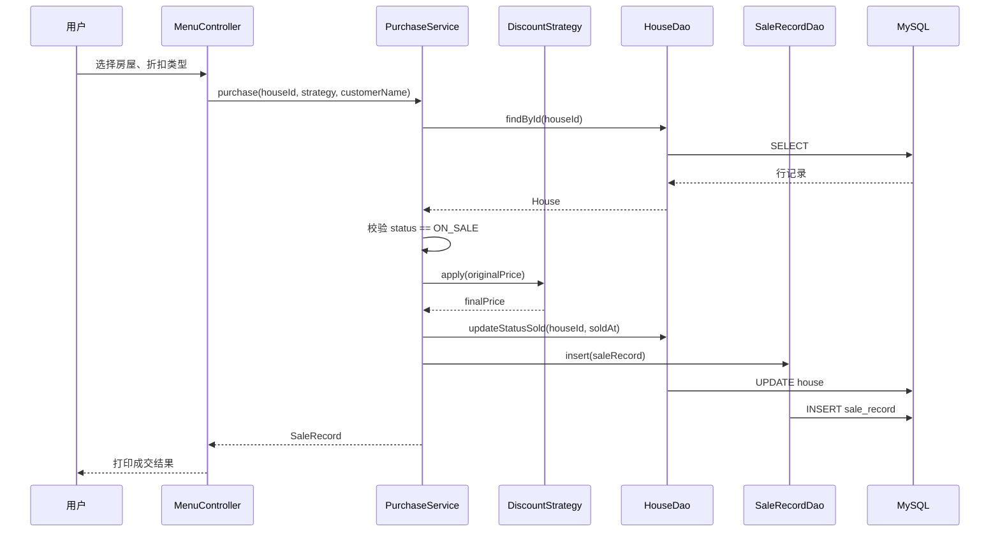

# Java 技术框架说明

> **读者**：技术组  
> **状态**：初版框架规定（v0.1）  
> **关联**：[数据库设计.md](./数据库设计.md) | [代码注释规范.md](./代码注释规范.md) | [课堂知识点对照.md](./课堂知识点对照.md) | [sql/schema.sql](../../sql/schema.sql)

---

## 1. 技术栈

| 项 | 选型 | 说明 |
|----|------|------|
| 语言 | Java 17 | `pom.xml` 已配置 |
| 构建 | Maven | `mvn compile` / `mvn exec:java` |
| 数据库驱动 | mysql-connector-j 8.3 | JDBC 访问 MySQL |
| 测试 | JUnit 5 | Service 层单元测试 |
| 界面 | 控制台 | 禁止 GUI / Web |

---

## 2. 分层架构

### 2.1 总体结构

```
┌──────────────────────────────────────────────────┐
│  Main.java          程序入口，启动 MenuController   │
├──────────────────────────────────────────────────┤
│  cli（表示层）      菜单、输入、输出                │
├──────────────────────────────────────────────────┤
│  service（业务层）  规则校验、流程编排、折扣调用     │
├──────────────────────────────────────────────────┤
│  dao（数据访问层）  JDBC、SQL、ResultSet → model   │
├──────────────────────────────────────────────────┤
│  MySQL              building / house / sale_record │
└──────────────────────────────────────────────────┘

横切：model | config | discount | util
```

### 2.2 层间调用规则

| 规则 | 说明 |
|------|------|
| R1 | `cli` 只调用 `service`，禁止直接调用 `dao` |
| R2 | `service` 只调用 `dao` 和 `discount`，禁止拼 SQL |
| R3 | `dao` 只做 CRUD 与查询映射，不做业务判断 |
| R4 | `model` 为纯数据载体，不含业务逻辑 |
| R5 | `config` 仅负责数据库连接，被 `dao` 使用 |

### 2.3 请求处理流程（以购房为例）



---

## 3. 包结构与类职责

根包：`com.building.manos`

```
src/main/java/com/building/manos/
├── Main.java
├── config/
│   └── DBConfig.java
├── model/
│   ├── Building.java
│   ├── House.java
│   ├── HouseStatus.java          # 枚举 ON_SALE / SOLD
│   └── SaleRecord.java
├── dao/
│   ├── BuildingDao.java
│   ├── HouseDao.java
│   └── SaleRecordDao.java
├── service/
│   ├── BuildingService.java
│   ├── HouseService.java
│   ├── SearchService.java
│   └── PurchaseService.java
├── discount/
│   ├── DiscountStrategy.java     # 接口
│   ├── PercentageDiscount.java   # 比例折扣
│   └── ThresholdDiscount.java    # 满减
├── cli/
│   ├── MenuController.java
│   └── ConsoleUtils.java
└── util/
    ├── IdGenerator.java
    └── Validator.java
```

### 3.1 类职责一览

| 类 | 包 | 职责 | 编写优先级 |
|----|-----|------|-----------|
| `Main` | 根 | 启动系统 | P0 |
| `DBConfig` | config | 读取连接配置，提供 `getConnection()` | P0 |
| `Building` | model | 楼盘实体 | P0 |
| `House` | model | 房屋实体 | P0 |
| `HouseStatus` | model | 销售状态枚举 | P0 |
| `SaleRecord` | model | 成交记录实体 | P1 |
| `BuildingDao` | dao | 楼盘表 CRUD | P0 |
| `HouseDao` | dao | 房屋表 CRUD + 条件查询 | P0 |
| `SaleRecordDao` | dao | 成交记录写入与列表 | P1 |
| `BuildingService` | service | 楼盘业务（含删除前校验） | P0 |
| `HouseService` | service | 房屋业务（含总价计算） | P0 |
| `SearchService` | service | 多条件组合查询 | P1 |
| `PurchaseService` | service | 购买流程、折扣、落库 | P1 |
| `DiscountStrategy` | discount | 折扣策略接口 | P1 |
| `PercentageDiscount` | discount | 按比例折扣 | P1 |
| `ThresholdDiscount` | discount | 满额减固定金额 | P2 |
| `MenuController` | cli | 主菜单与子菜单路由 | P0 |
| `ConsoleUtils` | cli | 读入、打印表格、确认提示 | P0 |
| `IdGenerator` | util | 生成 B/H/S 前缀主键 | P0 |
| `Validator` | util | 非空、正数、价格区间校验 | P1 |

---

## 4. 核心接口规定

以下为技术组**必须遵循**的方法签名（可先空实现，合并时不得随意改名）。

### 4.1 config

```java
public final class DBConfig {
    public static Connection getConnection() throws SQLException;
}
```

配置来源（优先级从高到低）：

1. 环境变量：`DB_URL`、`DB_USER`、`DB_PASSWORD`
2. `src/main/resources/database.properties`（课堂 Properties 方式）
3. 代码内默认值

### 4.2 model

```java
public enum HouseStatus { ON_SALE, SOLD }

public class Building { /* id, name, landArea, address, developer, remark, createdAt */ }
public class House { /* id, buildingId, buildingNo, roomNo, area, unitPrice, totalPrice, status, soldAt */ }
public class SaleRecord { /* id, houseId, originalPrice, discountType, discountValue, finalPrice, customerName, soldAt */ }
```

字段命名：**Java 驼峰** ↔ 数据库下划线，由 dao 映射。

### 4.3 dao

```java
public class BuildingDao {
    int insert(Building building);
    Building findById(String id);
    List<Building> findAll();
    int update(Building building);
    int deleteById(String id);
}

public class HouseDao {
    int insert(House house);
    House findById(String id);
    int update(House house);
    int deleteById(String id);
    int countByBuildingId(String buildingId);
    List<House> findByBuildingId(String buildingId);
    List<House> findByPriceRange(BigDecimal min, BigDecimal max, HouseStatus status);
    List<House> findByAreaRange(BigDecimal min, BigDecimal max, HouseStatus status);
    int updateStatusSold(String houseId, LocalDateTime soldAt);
}

public class SaleRecordDao {
    int insert(SaleRecord record);
    List<SaleRecord> findAll();
    List<SaleRecord> findByHouseId(String houseId);
}
```

### 4.4 service

```java
public class BuildingService {
    void add(Building building);           // 校验 + insert
    void update(Building building);
    void delete(String buildingId);        // 有关联房屋则抛异常
    Building getById(String id);
    List<Building> listAll();
}

public class HouseService {
    void add(House house);                 // 自动算 totalPrice = area * unitPrice
    void update(House house);              // 仅 ON_SALE 可改
    void delete(String houseId);           // 仅 ON_SALE 可删
    House getById(String id);
    List<House> listByBuilding(String buildingId);
}

public class SearchService {
    List<House> searchByBuildingName(String name);
    List<House> searchByBuildingNo(String buildingNo);
    List<House> searchByPriceRange(BigDecimal min, BigDecimal max);
    List<House> searchByAreaRange(BigDecimal min, BigDecimal max);
    List<House> searchByStatus(HouseStatus status);
}

public class PurchaseService {
    SaleRecord purchase(String houseId, DiscountStrategy strategy, String customerName);
}
```

### 4.5 discount

```java
public interface DiscountStrategy {
    /** @return 折后实付金额 */
    BigDecimal apply(BigDecimal originalPrice);
    String getTypeName();
    BigDecimal getDiscountValue();  // 记录到 sale_record.discount_value
}
```

| 实现类 | 算法 |
|--------|------|
| `PercentageDiscount` | `originalPrice × rate`，rate ∈ (0, 1] |
| `ThresholdDiscount` | 若 `originalPrice >= threshold` 则减 `reduceAmount`，否则不变 |

### 4.6 cli

```java
public class MenuController {
    void run();   // 主循环：显示菜单 → 分发 → 直到退出
}

public final class ConsoleUtils {
    static String readLine(String prompt);
    static int readInt(String prompt, int min, int max);
    static BigDecimal readDecimal(String prompt);
    static boolean confirm(String message);
    static void printTable(List<String[]> rows, String[] headers);
    static void pause();
}
```

---

## 5. 主菜单框架

```
主菜单
├── 1. 楼盘管理 → BuildingSubMenu
│     ├── 1.1 新增楼盘
│     ├── 1.2 修改楼盘
│     ├── 1.3 删除楼盘
│     └── 1.4 查看楼盘列表
├── 2. 房屋管理 → HouseSubMenu
│     ├── 2.1 新增房屋
│     ├── 2.2 修改房屋
│     ├── 2.3 删除房屋
│     └── 2.4 查看房屋列表
├── 3. 房屋查询 → SearchSubMenu
│     ├── 3.1 按楼盘名称
│     ├── 3.2 按楼号
│     ├── 3.3 按价格区间
│     ├── 3.4 按面积区间
│     └── 3.5 按销售状态
├── 4. 房屋购买 → PurchaseSubMenu
│     ├── 选择在售房屋
│     ├── 选择折扣类型
│     ├── 输入客户姓名
│     └── 确认成交
├── 5. 销售记录 → 调用 SaleRecordService.listAll()（或 PurchaseService）
└── 0. 退出
```

`MenuController` 持有各 `Service` 实例；子菜单用**私有方法**即可，不必再拆独立类。

---

## 10. 运行与交付架构（脚本 → 终端）

本系统最终交付形态：**双击/执行脚本 → 终端出现菜单 → 键盘操作**。架构按此设计，无多余组件。

### 10.1 运行时链路

```
scripts/run.ps1（或 run.sh）
    → mvn compile + mvn exec:java
        → Main.main()
            → new MenuController().run()
                → Scanner 读入 / System.out 输出
                    → XxxService → XxxDao → MySQL
```

**全进程单线程、单控制台窗口**，不需要 Web 容器、不需要 GUI、不需要多进程。

### 10.2 脚本职责（答辩用）

| 脚本 | 作用 |
|------|------|
| `scripts/run.ps1` | Windows：编译并启动 |
| `scripts/run.sh` | Linux/macOS：编译并启动 |

答辩前约定：

1. 本机 MySQL 已启动，已执行 `sql/schema.sql`
2. `database.properties` 密码与本机一致
3. 直接运行脚本，**不要**要求评委手动 `mvn` 敲命令

### 10.3 Main 入口（实现后）

```java
public static void main(String[] args) {
    try {
        new MenuController().run();
    } catch (Exception e) {
        System.out.println("系统异常：" + e.getMessage());
    }
}
```

Main **只做启动**，不写菜单逻辑（菜单全在 `cli` 包）。

### 10.4 架构是否过度设计？

| 模块 | 是否必要 | 说明 |
|------|----------|------|
| cli / service / dao 三层 | ✅ 必要 | 课程硬性要求分层 |
| 4 个 Service 类 | ✅ 合理 | 对应业务模块，答辩好讲 |
| DiscountStrategy | ✅ 合理 | 满足折扣功能 + 策略模式加分 |
| `repository` 包 | ❌ 不用 | 已规定用 `dao`，删除或勿建此类 |
| 连接池 HikariCP | ⭕ 可选 | 控制台作业可不引入 |
| dao 接口 + Impl 拆分 | ⭕ 可选 | 鲜花商店有，本项目**具体类即可**，更简单 |

**结论**：对「脚本 + 终端 + 课程分层」而言，当前架构**恰到好处**，不是过度设计；切忌再叠 Spring Boot、Swing 等。

---

## 6. 异常与错误处理约定

| 场景 | 处理方式 |
|------|----------|
| 用户输入非法 | `cli` 提示重新输入，不抛到顶层 |
| 业务规则不满足 | `service` 抛 `IllegalArgumentException` 或自定义 `BusinessException` |
| 数据库连接失败 | `dao` 记录后向上抛，`cli` 打印友好提示 |
| 房屋已售出仍购买 | `PurchaseService` 抛业务异常 |
| 删除含房屋的楼盘 | `BuildingService` 抛业务异常 |

---

## 7. 开发顺序（技术组）

```
阶段 1（P0）连通性
  DBConfig → Building/House model → BuildingDao/HouseDao
  → BuildingService/HouseService → MenuController 骨架

阶段 2（P1）核心功能
  SearchService + 查询菜单
  DiscountStrategy + PurchaseService + SaleRecordDao
  购买菜单

阶段 3（P2）完善
  ThresholdDiscount、销售记录查看
  Validator 补齐、JUnit 测试、init-data.sql
```

### 7.1 分支与文件归属建议

| 成员 | 负责包 | 首批文件 |
|------|--------|----------|
| A | config + model + dao(Building*) | DBConfig, Building, BuildingDao |
| B | dao(House*) + model | House, HouseStatus, HouseDao |
| C | service(Building/House) | BuildingService, HouseService |
| D | cli | MenuController, ConsoleUtils |
| E | service(Search/Purchase) + discount | SearchService, PurchaseService, discount 包 |

实际分工填入 `docs/report/团队分工表.md`。

---

## 8. 测试约定

| 层级 | 测试方式 |
|------|----------|
| service | JUnit 5，dao 可 Mock 或连测试库 |
| dao | 集成测试，使用 `building_manos` 测试库或 H2（可选） |
| cli | 答辩前手工走查脚本（见 `项目计划.md` §6.1） |

测试目录：`src/test/java/com/building/manos/`

---

## 9. 配置与运行

详见 **§10 运行与交付架构**。快速命令：

```bash
# 建库（首次）
mysql -u root -p < sql/schema.sql

# 推荐：一键脚本启动（答辩用）
scripts/run.ps1        # Windows
scripts/run.sh         # Linux/macOS

# 或手动
mvn clean compile
mvn exec:java
```

---

## 11. 课堂知识点在本项目中的应用

> 详细对照表见 [课堂知识点对照.md](./课堂知识点对照.md)  
> 课堂示例代码：`docs/course_example_java_learn/`

### 11.1 分层：参照鲜花商店，做规范化改进

| 课堂（鲜花商店） | 本项目 |
|------------------|--------|
| `entity` | `model` |
| `dao` + `BaseDao` | `dao` + `config/DBConfig` |
| `service` | `service` |
| `Main` + `Scanner` | `cli/MenuController` + `ConsoleUtils` |

**改进**：cli 禁止直接 `new XxxDao()`（课堂 Main 中存在此写法，本项目不允许）。

### 11.2 JDBC 写法（课堂第 7 课）

dao 层统一采用课堂 **PreparedStatement** 安全写法：

```java
try (Connection conn = DBConfig.getConnection();
     PreparedStatement ps = conn.prepareStatement(
         "INSERT INTO building (id, name, land_area, address, developer, remark) VALUES (?,?,?,?,?,?)")) {
    ps.setString(1, building.getId());
    ps.setBigDecimal(2, building.getLandArea());
    // ...
    return ps.executeUpdate();
}
```

- 驱动：`com.mysql.cj.jdbc.Driver`（课堂旧示例为 `com.mysql.jdbc.Driver`）
- 禁止 `Statement` + 字符串拼接 SQL（课堂 §5 已演示不安全）

参考：`JDBC代码/代码/7使用preparestatement/`、`鲜花商店/dao/BaseDao.java`

### 11.3 控制台菜单（课堂 Main 模式）

```java
// 课堂：Scanner + switch + while 循环
// 本项目：封装在 MenuController.run() 与 ConsoleUtils
```

参考：`鲜花商店/.../test/Main.java` 的菜单循环与 `switch-case` 结构。

### 11.4 接口与策略（课堂 Buyable → 本项目 DiscountStrategy）

```java
public interface DiscountStrategy {
    BigDecimal apply(BigDecimal originalPrice);
    String getTypeName();
}
```

参考：`鲜花商店/service/Buyable.java`、`Sellable.java`

### 11.5 集合与异常

- 查询返回 `List<House>`，用 `ArrayList` 填充（同课堂 `FlowerStoreDaoImpl`）
- dao 使用 `try-with-resources` 或 `finally` 关闭资源（课堂异常处理代码）
- service 业务失败用 `throw new IllegalArgumentException(...)` 或自定义 `BusinessException`

### 11.6 数据库配置（课堂 Properties）

`src/main/resources/database.properties`（与课堂 `database.properties` 同模式）：

```properties
driver=com.mysql.cj.jdbc.Driver
url=jdbc:mysql://localhost:3306/building_manos?useUnicode=true&characterEncoding=UTF-8&serverTimezone=Asia/Shanghai
user=root
password=root
```

`DBConfig` 优先读环境变量，其次读此文件（见 §4.1）。

---

## 12. DBConfig 实现规定（对齐课堂 BaseDao）

`config/DBConfig.java` 职责对应课堂 `BaseDao` 的连接部分：

| 方法 | 职责 |
|------|------|
| `getConnection()` | 加载驱动、返回 `Connection` |
| `close(AutoCloseable...)` | 可选静态工具，关闭 rs/ps/conn |

**不推荐**把整个 `executeSQL` 塞进 DBConfig；增删改查 SQL 留在各 `XxxDao` 中，职责更清晰。

---

## 13. 异常处理约定（课堂知识点）

| 层级 | 做法 |
|------|------|
| dao | `SQLException` 向上抛或包装；资源在 `finally` / try-with-resources 关闭 |
| service | 捕获 SQL 异常转友好信息；业务用 `IllegalArgumentException` |
| cli | 捕获异常，`System.out.println` 提示用户，不打印堆栈给用户看 |

参考：`异常处理代码/代码/3、加上trycatchfinally/`

---

## 14. 变更记录

| 版本 | 日期 | 变更 |
|------|------|------|
| v0.1 | 2026-07-10 | 初版框架：包结构、类职责、接口签名、菜单结构 |
| v0.2 | 2026-07-10 | 补充课堂知识点应用、JDBC/异常/Properties 规定 |
| v0.3 | 2026-07-10 | 补充脚本启动运行架构；修正菜单层调用 service |
