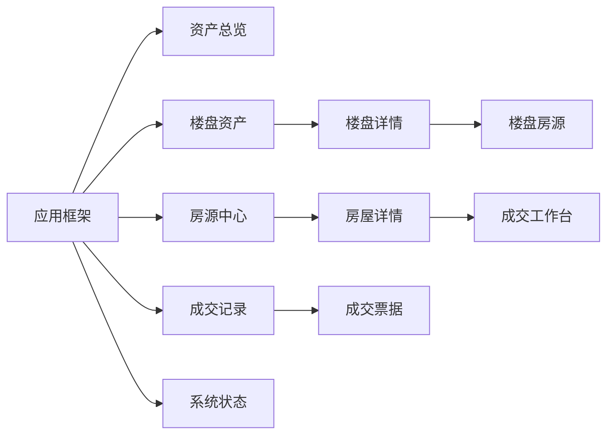

# Building ManOS Vue 前端美术概念设计

> **概念代号**：Urban Ledger / 城市资产中枢
> **文档版本**：v0.1
> **日期**：2026-07-13
> **状态**：概念方案，可进入低保真原型与 API 设计

---

## 0. 决策变更与边界

本方案依据新的产品决策，为 Building ManOS 增加基于 Vue 的 Web 前端。该决策与现有项目规则、需求分析和概要设计中的“仅控制台、禁止 Web”约束冲突；进入开发前应同步修订旧约束，以本次新决策为准。

当前仓库已有楼盘、房屋、查询、折扣购买和成交记录的数据层与业务层，但尚不存在 HTTP API，`Main` 仍是控制台骨架。目标调用链应调整为：

```text
Vue SPA → HTTP API / Controller → service → dao → MySQL
```

设计边界：

- 第一版仍是单一操作员，不新增登录、权限、客户 CRM 等未提出能力。
- Vue 不直接连接 MySQL，不在前端重复实现成交事务或最终价格规则。
- 前端可以实时预览价格，服务端仍是成交金额和状态的最终权威。
- 当前数据模型没有照片、经纬度、楼层、户型图或 3D 模型，界面不得伪造这些数据。
- 3D 必须帮助理解资产空间和状态，不能阻碍 CRUD、查询或成交。

---

## 1. 产品与艺术方向

### 1.1 一句话定位

**面向房地产公司内部操作员的高端资产与成交工作台，用建筑空间语言组织楼盘、房源和交易数据。**

核心体验：快速看清资产库存、定位目标房屋、安全完成折扣成交、清晰追溯成交记录。

### 1.2 概念关键词

| 关键词 | 视觉表达 | 业务意义 |
|---|---|---|
| 建筑秩序 | 网格、轴线、平面图细线、模块化卡片 | 对应楼盘—楼栋—房屋层级 |
| 克制奢华 | 深墨色、暖象牙白、少量香槟金、宽留白 | 符合高价值房地产资产气质 |
| 数据可信 | 明确数字层级、状态色、不可变成交票据 | 降低误操作和价格理解成本 |
| 空间感 | 2.5D 建筑体块、深度层级、局部 3D | 将库存状态从表格升级为空间认知 |

### 1.3 品牌表达

- 主标识可用 `BM` 组合成双塔与门廊轮廓。
- 品牌名保持 `Building ManOS`，副标题使用“城市资产中枢”。
- 图形母题采用建筑立面竖线、地籍边界和门窗比例，不使用常见房顶剪影。
- 高级感依靠比例、材质和留白，不依靠大面积金色、玻璃拟态或强发光。

---

## 2. 真实产品参考

| 参考 | 可借鉴点 | 本项目转化 | 明确不照搬 |
|---|---|---|---|
| [Compass](https://www.compass.com/) | 搜索优先、房源浏览入口明确 | 全局搜索置于顶栏；房源中心以筛选直接驱动结果 | 不引入租赁、经纪人和贷款业务 |
| [UK Sotheby's International Realty](https://sothebysrealty.co.uk/) | 大图、宽留白、编辑式排版、克制的信息密度 | 用于楼盘详情头部、价格数字与高级材质语言 | 不把内部管理页做成营销长页 |
| [Mapbox Standard](https://docs.mapbox.com/map-styles/reference/standard/) | 3D 建筑、昼夜光照、建筑 hover/select | 有经纬度后用于楼盘空间入口和建筑高亮 | P0 不因缺少坐标强行接入地图 |
| [Matterport Digital Twin](https://matterport.com/digital-twin-features) | 3D 数字孪生与房产详情结合 | 未来仅在单个楼盘/房屋详情按需加载 | 不在列表和成交工作流持续运行重型 3D |

参考只用于提炼交互原则和视觉气质，最终界面保持 Building ManOS 自身的建筑资产管理身份。

---

## 3. 视觉系统

### 3.1 色彩 Token

| Token | 色值 | 用途 |
|---|---:|---|
| `ink-950` | `#0B1320` | 左侧导航、深色标题区、3D 场景底色 |
| `ink-800` | `#1B2A3A` | 次级深色面、悬浮态 |
| `stone-50` | `#F6F4EF` | 主工作区背景，模拟建筑纸张 |
| `paper-0` | `#FFFFFF` | 表格、表单、抽屉和主卡片 |
| `champagne-500` | `#B99A63` | 品牌强调、选中轮廓、关键数字 |
| `emerald-600` | `#207A63` | `ON_SALE`、成功、可操作资产 |
| `copper-600` | `#9A5E43` | `SOLD`、成交信息 |
| `red-600` | `#B44545` | 删除、数据库失败、校验错误 |
| `line-200` | `#D9D5CC` | 建筑网格、分隔线、输入框边界 |

规则：

- 主工作区使用暖浅色，导航和少量沉浸详情头部使用深色。
- 香槟金只占约 5% 的视觉面积，用于选中、价格和品牌细节。
- `SOLD` 使用铜棕而非错误红；售出是业务状态，不是异常。
- 状态不得只靠颜色，必须同时显示文字、图标或形状。

### 3.2 字体、数字与材质

- 中文正文：`Noto Sans SC` / `Source Han Sans SC`；英文品牌和大数字：`Manrope`。
- 金额启用等宽数字特性 `font-variant-numeric: tabular-nums`。
- 页面标题 28–32 px；关键指标 32–44 px；正文 14–16 px；表格不低于 14 px。
- 金额默认以“万元”显示并保留两位小数，详情和票据可查看精确到元的值。
- 卡片圆角 12 px，表单控件 8 px，主要依靠边框和层级而不是浮夸阴影。
- 背景可叠加 4%–6% 透明度的建筑轴网或地籍线。
- 缺少房产图片时使用抽象建筑线稿和楼盘首字母，不使用无关豪宅图库冒充真实房源。

### 3.3 动效

- 页面切换使用 160–220 ms 淡入与 8 px 位移。
- 卡片 hover 只增强边框并抬高 2 px，不做大幅缩放。
- 成交确认时价格数字平滑重排；成功后用简短门廊闭合动画表达“归档成交”。
- 遵循 `prefers-reduced-motion`，关闭相机漂移、粒子和非必要转场。

---

## 4. 信息架构



| 路由 | 页面 | 导航层级 |
|---|---|---|
| `/dashboard` | 资产总览 | 一级 |
| `/buildings` | 楼盘资产 | 一级 |
| `/buildings/:id` | 楼盘详情 | 二级 |
| `/houses` | 房源中心 / 查询 | 一级 |
| `/houses/:id` | 房屋详情 | 二级 |
| `/transactions/new?houseId=` | 成交工作台 | 一级快捷入口 / 流程页 |
| `/sales` | 成交记录 | 一级 |
| `/sales/:id` | 成交票据 | 二级，需补充按成交 ID 查询能力 |
| `/system` | 数据库与运行状态 | 一级底部入口 |

桌面端使用 232 px 深色侧栏和顶部全局操作栏；移动端侧栏收为抽屉。一级导航控制在五个业务入口，不建立重复的“搜索”页面，搜索即房源中心的核心状态。

---

## 5. 全部程序功能与前端元素

### 5.1 楼盘管理

| 程序功能 | 对应前端元素 | 规则与状态 |
|---|---|---|
| 查看全部楼盘 | 卡片/表格切换、结果计数、楼盘摘要卡 | 突出名称、地址、占地面积、开发商 |
| 查看楼盘详情 | 深色详情头、属性清单、关联房源区 | 显示编号、创建时间、备注和库存摘要 |
| 新增楼盘 | 右侧大抽屉、分组表单、保存按钮 | 名称、占地面积、地址必填；开发商、备注可选 |
| 修改楼盘 | “编辑”按钮、预填抽屉、变更摘要 | 成功后局部刷新，不丢失详情上下文 |
| 删除空楼盘 | 危险确认对话框 | 明确显示名称和编号，不用通用确认文案 |
| 禁止删除非空楼盘 | 禁用动作或服务端错误面板、关联房源链接 | 提示仍有多少房屋并引导处理 |

### 5.2 房屋管理

| 程序功能 | 对应前端元素 | 规则与状态 |
|---|---|---|
| 按楼盘查看房屋 | 楼盘详情库存表、状态分段栏 | 保留返回楼盘详情的上下文 |
| 查看房屋详情 | 价格主卡、属性网格、状态时间线、操作区 | 显示楼盘、楼号、房号、面积、单价、总价 |
| 新增房屋 | 分步抽屉：选楼盘 → 房屋信息 → 价格确认 | 楼盘必须存在；默认 `ON_SALE` |
| 自动计算总价 | 面积与单价下方的实时公式卡 | 前端仅预览；服务端总价覆盖预览值 |
| 修改在售房屋 | “编辑房屋”按钮、预填表单 | 仅 `ON_SALE` 可用，保存后重算总价 |
| 禁止修改已售房屋 | 只读锁定条、成交记录入口 | 明示“已售资产不可修改” |
| 删除在售房屋 | 危险确认对话框 | 展示楼盘、楼号、房号以避免删错 |
| 禁止删除已售房屋 | 禁用动作、成交票据链接 | 不将不可删除误显示为系统错误 |
| 防止重复房号 | 楼号/房号组合校验提示 | 对应 `uk_building_room`，错误定位到输入项 |

### 5.3 房屋查询

| 程序功能 | 对应前端元素 | 规则与状态 |
|---|---|---|
| 按楼盘名称模糊查询 | 顶部主搜索框、关键词高亮 | 输入防抖，URL 保留条件 |
| 按楼号查询 | 楼号输入框 / 可选标签 | 清除条件后恢复结果 |
| 按总价区间查询 | 双输入金额范围、常用档位标签 | 校验非负且下限不大于上限 |
| 按面积区间查询 | 双输入面积范围、单位后缀 `㎡` | 行内显示范围错误 |
| 按状态查询 | `全部 / 在售 / 已售` 分段控件 | 同步改变状态徽标和可用动作 |
| 无结果 | 建筑线稿空状态、条件摘要、清除筛选 | 不只显示“暂无数据” |
| 结果浏览 | 默认表格、可选资产卡、排序和结果计数 | 组合筛选需统一查询 API 后启用 |

### 5.4 房屋购买

| 程序功能 | 对应前端元素 | 规则与状态 |
|---|---|---|
| 选择在售房屋 | 表格行“进入成交”、详情页主按钮 | 已售房屋不显示购买按钮 |
| 查看详情与原价 | 工作台左侧固定资产摘要 | 始终可核对楼盘、房号、面积和原价 |
| 比例折扣 | `DiscountStrategyCard` 比例折扣卡 | 展示档位和“原价 × 折扣率” |
| 满额减 | `DiscountStrategyCard` 满减卡 | 展示档位和“原价 − 减免额” |
| 折扣档位 | 三段价格刻度 | 高亮当前价格档 |
| 实付计算 | 大号实付金额、节省金额、计算明细 | 前端预览，提交后使用服务端返回值 |
| 客户姓名 | 带字符计数的文本输入 | 必填并去除首尾空格 |
| 确认成交 | 二次确认面板、不可逆说明 | 按钮写“确认成交 ¥…”而非“提交” |
| 更新为已售 | 成功回执、状态徽标、时间线 | 刷新房源缓存并禁止再次操作 |
| 写入成交记录 | 成交编号、客户、折扣和金额票据 | 提供查看记录与返回房源两条路径 |
| 防止重复购买 | 冲突提示、刷新状态按钮 | 服务端返回已售时立即退出成交态 |

折扣展示必须与 Java 实现一致：

| 原价档位 | 比例折扣 | 满减 |
|---|---:|---:|
| `< 100 万` | 不打折（1.00） | 减 2 万 |
| `100 万 ≤ 原价 < 300 万` | 0.97 | 减 5 万 |
| `≥ 300 万` | 0.92 | 减 15 万 |

### 5.5 成交记录

| 程序功能 | 对应前端元素 | 规则与状态 |
|---|---|---|
| 查看全部成交历史 | 只读账本表、成交总额摘要、时间排序 | 默认最新在前，API 需明确排序 |
| 按房屋编号查询 | 表头搜索 / 房屋编号过滤器 | 当前 DAO 已有 `findByHouseId` |
| 查看成交详情 | 票据抽屉或详情页 | 展示原价、折扣、实付、客户和时间 |
| 一房一成交 | 房屋状态与票据一一关联 | 对应 `uk_sale_house`，无手工新增入口 |
| 记录不可变 | 无编辑、无删除操作、锁形提示 | 保持成交历史审计语义 |

### 5.6 系统辅助

| 程序功能 | 对应前端元素 | 规则与状态 |
|---|---|---|
| 主导航 | 固定侧栏、面包屑、快捷创建菜单 | 当前模块和上级实体始终可见 |
| 输入合法性校验 | 行内错误、字段状态、错误摘要聚焦 | 数字、空值、范围前后端一致 |
| 数据库连接失败 | 全局断连页、重试、配置指引 | 不泄露数据库 URL、用户或密码 |
| 演示数据初始化 | 系统状态页的初始化说明/受控按钮 | P0 先提供说明；真正按钮需受控 API |
| 加载中 | 表格骨架、按钮局部 loading | 不用全屏转圈阻塞整个系统 |
| 操作反馈 | 顶部轻提示 + 页面内更新 | 成交成功必须有持久回执 |

---

## 6. 关键页面概念

### 6.1 应用框架

左侧深色导航像一块建筑铭牌；品牌区由双塔 `BM` 标识和系统名组成。导航底部固定显示数据库状态。顶部栏包含面包屑、全局房源搜索和快捷新增，不设置无实际用途的头像菜单。

```text
┌──────────────┬────────────────────────────────────────────────────┐
│ BM / ManOS   │ 面包屑        [搜索楼盘/楼号/房号]    + 快捷创建  │
│              ├────────────────────────────────────────────────────┤
│ 资产总览     │                                                    │
│ 楼盘资产     │                   主工作区                         │
│ 房源中心     │                                                    │
│ 成交工作台   │                                                    │
│ 成交记录     │                                                    │
│              │                                                    │
│ ● 数据库正常 │                                                    │
└──────────────┴────────────────────────────────────────────────────┘
```

### 6.2 资产总览

目标是在 10 秒内回答“有多少楼盘、多少在售、多少已售、最近成交如何”。顶部为四张指标卡：楼盘总数、在售套数、已售套数、累计成交额；中部左侧是 2.5D 城市资产体块，右侧是库存状态和价格档位；底部展示最近成交和重点楼盘库存。

只显示能从现有三张表计算的数据，不制造同比、销售目标、客户转化率等无数据来源指标。

### 6.3 楼盘资产与详情

默认使用信息密度适中的卡片，显示名称、地址、占地面积、开发商和房源状态条；数据较多时切换表格。新增/编辑使用右侧抽屉。

详情页顶部使用深墨色沉浸头部，背景为该楼盘的抽象线性体块；下方按“基本信息 / 房源库存 / 成交概览”组织。P0 抽象体块不宣称是真实建筑模型。

### 6.4 房源中心

顶部为主搜索和折叠式高级筛选，默认表格包含：楼盘/楼号/房号、面积、单价、总价、状态和动作。数值右对齐并使用等宽数字。选中一行后右侧打开快速详情；卡片视图服务于展示，表格视图服务于管理，两者共享筛选状态。

### 6.5 成交工作台

使用单页三步流程而不是多层弹窗：

1. 确认资产与原价；
2. 比较比例折扣和满减，实时显示节省金额；
3. 输入客户姓名，确认最终票据并成交。

右侧始终固定价格结算卡。成功后进入回执状态并防止重复提交；若服务端返回“房屋已售”，立即锁定页面并引导刷新。

### 6.6 成交记录与系统状态

成交记录采用“资产账本”视觉，顶部可显示累计成交金额、成交套数和平均成交价，记录本身不可编辑。详情以契约票据排版突出成交编号、原价、优惠、实付和时间。

系统状态页仅包含数据库连通性、后端/前端版本、初始化状态和演示数据说明。P0 不提供修改数据库凭据的 Web 表单。

---

## 7. 3D 与空间元素

| 阶段 | 3D 能力 | 数据要求 | 降级方案 |
|---|---|---|---|
| P0 | 仪表盘抽象建筑体块、楼盘卡 2.5D 线稿 | 楼盘/房屋数量和状态 | 静态 SVG 建筑轴测图 |
| P1 | 按楼栋分组的库存体块，在售/已售着色 | 当前 `building_no` 可分组；精确楼层需 `floor_no` | 楼栋状态矩阵 |
| P1 | 可点击参数化体块，hover 显示房屋摘要 | 房屋和楼栋编号 | 表格与右侧详情联动 |
| P2 | 真实 3D 地图与楼盘定位 | `latitude`、`longitude` | 地址列表或 2D 地图 |
| P2 | 数字孪生/室内漫游 | `tour_url` 或 `model_url`、真实素材 | 户型图或普通详情 |

数据真实性原则：

- 不从 `room_no` 猜测楼层；真实楼层模型需要明确的 `floor_no`。
- 不在浏览器中隐式地理编码并永久保存坐标；经纬度应由后台确认。
- 3D 与表格共享同一选中状态，且只表达真实的 `ON_SALE` / `SOLD`。
- Vue 轻量 3D 可使用 [TresJS](https://docs.tresjs.org/) 封装 Three.js。
- 3D 路由级懒加载；WebGL 不可用、低性能设备或减少动态偏好开启时回退 SVG。
- 3D 画布必须有键盘可达的等价列表，不能成为唯一操作入口。

---

## 8. 前端组件体系

### 8.1 基础组件

| 组件 | 职责 |
|---|---|
| `AppSidebar` | 一级导航、品牌和数据库状态 |
| `TopCommandBar` | 面包屑、全局搜索和快捷创建 |
| `MetricCard` | 指标、说明和数据来源状态 |
| `StatusBadge` | 在售、已售、连接正常、连接失败 |
| `MoneyText` | 元/万元格式化和等宽数字 |
| `RangeField` | 价格/面积上下限和范围校验 |
| `EntityDrawer` | 新增、编辑、快速详情的统一抽屉 |
| `ConfirmDialog` | 删除和成交二次确认 |
| `EmptyBlueprint` | 建筑线稿空状态 |
| `ErrorPanel` | 业务冲突、网络错误和数据库错误 |

### 8.2 领域组件

| 组件 | 职责 |
|---|---|
| `BuildingCard` | 楼盘摘要、库存状态条、进入详情 |
| `BuildingForm` | 楼盘新增/编辑表单 |
| `HouseTable` | 房源主表格和状态动作 |
| `HouseFilterBar` | 五类查询条件和 URL 同步 |
| `HousePriceFormula` | 面积 × 单价预览与服务端值对照 |
| `InventoryMassing` | 参数化楼栋/房屋状态体块 |
| `DiscountStrategyCard` | 比例折扣/满减对比与选中 |
| `PriceTierScale` | 房价档位与优惠参数 |
| `PurchaseSummary` | 原价、优惠、实付和客户摘要 |
| `SaleReceipt` | 只读成交票据 |
| `DatabaseHealth` | 数据库与 API 状态 |

组件围绕业务语义命名，避免无意义的 `Card1`、`Panel2`。

---

## 9. 交互、响应式与可访问性

### 9.1 表单与错误

- 首次进入不显示错误；失焦后校验，提交时聚焦第一个错误字段。
- 面积、单价、价格区间使用十进制字符串传输，避免 JavaScript 浮点误差。
- 自动生成的 ID 不作为新增表单输入项。
- 唯一约束冲突映射到楼号/房号，不显示 SQL 原文。
- 删除楼盘、删除房屋和成交均二次确认；成交使用品牌主按钮而非删除红。
- 页面分别定义加载、有数据、空数据、筛选无结果、网络错误、数据库错误、业务冲突、成功状态。

### 9.2 响应式

- `≥1280 px`：完整侧栏、双栏详情、固定成交摘要。
- `768–1279 px`：紧凑侧栏、筛选折叠、详情单栏。
- `<768 px`：侧栏抽屉、卡片化表格；仍能完成查询、查看和成交。

### 9.3 可访问性与性能

- 对比度达到 WCAG AA；状态同时用颜色、文字和图形表达。
- 图标按钮有可见 Tooltip 和无障碍名称；焦点顺序与视觉顺序一致。
- 3D、图表和颜色状态提供文本/表格等价内容。
- 非 3D 首屏优先；3D 与图表按路由拆包，不进入 CRUD 或成交的关键加载路径。
- 动画主要使用 `transform` 和 `opacity`，避免布局抖动。

---

## 10. Vue 与后端对接前置条件

### 10.1 前端基础

- Vue 3 + TypeScript + Composition API。
- [Vue Router](https://router.vuejs.org/guide/) 管理 SPA 路由、查询条件和详情参数。
- Pinia 只保存跨页面的楼盘摘要、筛选状态和成交刷新信号；局部表单状态留在组件内。
- P0 图表可先用 CSS/SVG，避免依赖膨胀；3D 原型确定后再引入 TresJS/Three.js。

### 10.2 当前后端缺口

当前 `pom.xml` 只有 MySQL JDBC 与 JUnit，不具备 Web Server、Controller、JSON 序列化或 CORS。Vue 开发前必须实现 HTTP 适配层并复用现有 service，Controller 不得直接调用 DAO。

| API 能力 | 对应现有能力 | 缺口/注意事项 |
|---|---|---|
| 楼盘列表、详情、新增、修改、删除 | `BuildingService` | 删除冲突需稳定错误码 |
| 房屋详情、按楼盘列表、新增、修改、删除 | `HouseService` | 需补统一列表或分页入口 |
| 房屋查询 | `SearchService` | 当前为五个独立方法；组合筛选需统一契约 |
| 成交 | `PurchaseService.purchase` | 事务和最终金额留在服务端 |
| 成交记录列表、按房屋查询 | `SaleRecordDao` | 应补 `SaleRecordService`，Controller 不直连 DAO |
| 总览摘要 | 可由三张表计算 | 建议后端一次聚合，避免前端多请求拼装 |
| 健康检查 | 数据库可连接性 | 只返回状态，不返回敏感配置 |

数据契约：ID 使用字符串；金额和面积使用十进制字符串；时间使用 ISO 8601；状态只允许 `ON_SALE`、`SOLD`；错误至少包含稳定 `code`、`message` 和可选 `fieldErrors`，不得暴露 SQLException 原文。

---

## 11. 实施分期

### P0：功能闭环与视觉基线

- 建立 Vue 3 + TypeScript 应用框架和设计 Token。
- 实现楼盘 CRUD、房屋 CRUD、五类查询、成交工作台、成交记录。
- 实现真实 API 对接以及加载、空、错、成功状态。
- 完成桌面端和基本移动适配。
- 使用 SVG/轻量 2.5D 资产体块，不依赖新数据库字段。

### P1：资产洞察与参数化 3D

- 增加总览聚合 API、库存指标和最近成交。
- 实现按楼栋分组的可交互库存体块。
- 按需新增明确楼层字段，绝不从房号猜测。
- 完成键盘操作、减少动态和静态降级验证。

### P2：真实空间与数字孪生

- 业务确有需要时再新增经纬度、封面图、模型或漫游 URL。
- 接入 3D 地图和楼盘定位。
- 在详情页按需嵌入真实模型/数字孪生。
- 定义素材上传、版权和存储策略后再启用媒体管理。

---

## 12. 设计验收标准

- 所有现有业务功能都能在前端找到唯一、明确的入口。
- 在售/已售的可用动作与服务端规则一致。
- 比例折扣、满减档位和最终金额与 Java 实现一致。
- 楼盘删除、房屋删除和成交均有符合风险等级的确认交互。
- 无数据、筛选无结果、数据库失败和业务冲突使用不同界面状态。
- 不展示数据库中不存在的照片、位置、楼层或户型信息。
- 3D 不阻塞 CRUD、查询和成交，并有静态等价视图。
- 高级感来自排版、材质和层级，不来自装饰堆叠。
- 前端不直连数据库，成交事务和最终价格由服务端裁决。

---

## 13. 下一阶段产物

1. 输出设计 Token 与基础/领域组件状态板；
2. 完成资产总览、房源中心、成交工作台三个桌面高保真页面；
3. 完成楼盘/房屋抽屉表单和所有错误状态；
4. 制作 P0 的 SVG/2.5D 建筑体块原型；
5. 根据页面数据需求冻结 REST API 契约；
6. 再开始 Vue 工程搭建，避免页面和数据模型反复返工。
