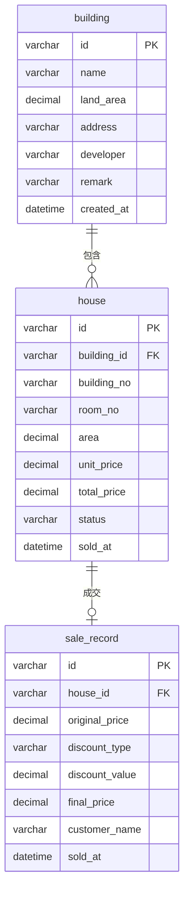

# 数据库设计说明

> **读者**：技术组  
> **状态**：初版框架规定（v0.1）  
> **DDL 脚本**：[sql/schema.sql](../../sql/schema.sql) | [sql/init-data.sql](../../sql/init-data.sql)  
> **关联**：[Java技术框架.md](./Java技术框架.md) | [课堂知识点对照.md](./课堂知识点对照.md)

---

## 1. 数据库概览

| 项 | 规定 |
|----|------|
| 数据库名 | `building_manos` |
| 引擎 | InnoDB |
| 字符集 | utf8mb4 / utf8mb4_unicode_ci |
| 访问方式 | JDBC（dao 层），禁止 cli/service 直连 |
| 脚本位置 | `sql/schema.sql`（结构）、`sql/init-data.sql`（演示数据） |

---

## 2. E-R 关系



**关系说明**：

- 一个楼盘（`building`）对应多套房屋（`house`），1:N
- 一套房屋（`house`）最多一条成交记录（`sale_record`），1:0..1（本期不做历史多次交易）
- 删除楼盘前必须先删除或转移其下房屋（业务层校验 + 外键约束）

---

## 3. 表结构详细说明

### 3.1 building（楼盘表）

| 列名 | 类型 | 空 | 默认 | 说明 |
|------|------|----|------|------|
| `id` | VARCHAR(32) | N | — | 主键，建议格式 `B` + 时间戳 |
| `name` | VARCHAR(100) | N | — | 楼盘名称 |
| `land_area` | DECIMAL(12,2) | N | — | 占地面积（㎡），> 0 |
| `address` | VARCHAR(200) | N | — | 地址 |
| `developer` | VARCHAR(100) | Y | NULL | 开发商 |
| `remark` | VARCHAR(500) | Y | NULL | 备注 |
| `created_at` | DATETIME | Y | CURRENT_TIMESTAMP | 创建时间 |

**索引**：主键 `id`

**业务约束**（service 层实现）：

- `name`、`land_area`、`address` 必填
- 删除时检查 `house.building_id` 是否仍有记录

---

### 3.2 house（房屋表）

| 列名 | 类型 | 空 | 默认 | 说明 |
|------|------|----|------|------|
| `id` | VARCHAR(32) | N | — | 主键，建议格式 `H` + 时间戳 |
| `building_id` | VARCHAR(32) | N | — | 外键 → building.id |
| `building_no` | VARCHAR(20) | N | — | 楼号，如 `3栋` |
| `room_no` | VARCHAR(20) | N | — | 房号，如 `1201` |
| `area` | DECIMAL(10,2) | N | — | 面积（㎡） |
| `unit_price` | DECIMAL(12,2) | N | — | 单价（元/㎡） |
| `total_price` | DECIMAL(14,2) | N | — | 总价（元）= area × unit_price |
| `status` | VARCHAR(20) | N | `ON_SALE` | `ON_SALE` / `SOLD` |
| `sold_at` | DATETIME | Y | NULL | 售出时间，在售时为 NULL |

**索引与约束**：

| 名称 | 类型 | 列 | 说明 |
|------|------|-----|------|
| PRIMARY | 主键 | `id` | |
| `fk_house_building` | 外键 | `building_id` | 引用 building(id) |
| `uk_building_room` | 唯一 | `building_id, building_no, room_no` | 同楼盘同楼号房号不可重复 |

**业务约束**：

- 新增时 `total_price` 由 service 计算后写入
- 仅 `status = ON_SALE` 可修改、删除
- 购买成功后：`status = SOLD`，`sold_at = NOW()`

---

### 3.3 sale_record（成交记录表）

| 列名 | 类型 | 空 | 默认 | 说明 |
|------|------|----|------|------|
| `id` | VARCHAR(32) | N | — | 主键，建议格式 `S` + 时间戳 |
| `house_id` | VARCHAR(32) | N | — | 外键 → house.id |
| `original_price` | DECIMAL(14,2) | N | — | 成交原价（元） |
| `discount_type` | VARCHAR(50) | Y | NULL | 如 `PERCENTAGE`、`THRESHOLD` |
| `discount_value` | DECIMAL(10,4) | Y | NULL | 折扣参数（率或满减额） |
| `final_price` | DECIMAL(14,2) | N | — | 实付金额（元） |
| `customer_name` | VARCHAR(50) | Y | NULL | 客户姓名 |
| `sold_at` | DATETIME | Y | CURRENT_TIMESTAMP | 成交时间 |

**索引与约束**：

| 名称 | 类型 | 列 |
|------|------|-----|
| PRIMARY | 主键 | `id` |
| `fk_sale_house` | 外键 | `house_id` → house(id) |
| `uk_sale_house` | 唯一 | `house_id` |

**写入时机**：`PurchaseService.purchase()` 成功时，与 `house` 状态更新同一业务流程。

---

## 4. Java 实体与表字段映射

| 表.列 | Java 类型 | Java 属性 |
|-------|-----------|-----------|
| building.id | String | Building.id |
| building.land_area | BigDecimal | Building.landArea |
| building.created_at | LocalDateTime | Building.createdAt |
| house.building_id | String | House.buildingId |
| house.building_no | String | House.buildingNo |
| house.unit_price | BigDecimal | House.unitPrice |
| house.total_price | BigDecimal | House.totalPrice |
| house.status | HouseStatus | House.status |
| house.sold_at | LocalDateTime | House.soldAt |
| sale_record.house_id | String | SaleRecord.houseId |
| sale_record.original_price | BigDecimal | SaleRecord.originalPrice |
| sale_record.discount_type | String | SaleRecord.discountType |
| sale_record.final_price | BigDecimal | SaleRecord.finalPrice |

**约定**：

- 金额、面积统一用 `BigDecimal`，dao 中 `ResultSet.getBigDecimal()`
- 日期时间用 `LocalDateTime`，dao 中 `getTimestamp().toLocalDateTime()`
- 枚举 `HouseStatus` 存库为字符串，读写时 `name()` / `valueOf()`

---

## 5. DAO 与 SQL 对照（框架规定）

技术组实现 dao 时，SQL 语义须与下表一致（写法可优化，语义不可变）。

### 5.1 BuildingDao

| 方法 | SQL 操作 | 要点 |
|------|----------|------|
| `insert` | `INSERT INTO building (...)` | 全字段插入 |
| `findById` | `SELECT * FROM building WHERE id = ?` | |
| `findAll` | `SELECT * FROM building ORDER BY created_at DESC` | |
| `update` | `UPDATE building SET ... WHERE id = ?` | 不更新 id |
| `deleteById` | `DELETE FROM building WHERE id = ?` | 删除前由 service 校验房屋 |

### 5.2 HouseDao

| 方法 | SQL 操作 | 要点 |
|------|----------|------|
| `insert` | `INSERT INTO house (...)` | 含 total_price、status |
| `findById` | `SELECT * FROM house WHERE id = ?` | |
| `countByBuildingId` | `SELECT COUNT(*) FROM house WHERE building_id = ?` | 删除楼盘前用 |
| `findByBuildingId` | `SELECT * FROM house WHERE building_id = ?` | |
| `findByPriceRange` | `SELECT * FROM house WHERE status = ? AND total_price BETWEEN ? AND ?` | min/max 可 NULL 时改 SQL |
| `findByAreaRange` | `SELECT * FROM house WHERE status = ? AND area BETWEEN ? AND ?` | |
| `updateStatusSold` | `UPDATE house SET status='SOLD', sold_at=? WHERE id=? AND status='ON_SALE'` | 防止并发重复售 |
| `deleteById` | `DELETE FROM house WHERE id = ? AND status = 'ON_SALE'` | |

### 5.3 SaleRecordDao

| 方法 | SQL 操作 | 要点 |
|------|----------|------|
| `insert` | `INSERT INTO sale_record (...)` | 购买成功后调用 |
| `findAll` | `SELECT * FROM sale_record ORDER BY sold_at DESC` | 答辩展示 |
| `findByHouseId` | `SELECT * FROM sale_record WHERE house_id = ?` | 一套房最多返回一条 |

### 5.4 查询楼盘名称（SearchService 用）

`SearchService.searchByBuildingName` 需联表或两步查询：

```sql
-- 方案 A：联表（推荐）
SELECT h.* FROM house h
INNER JOIN building b ON h.building_id = b.id
WHERE b.name LIKE ?
  AND h.status = 'ON_SALE';

-- 方案 B：先查 building.id 列表，再 IN 查询 house
```

---

## 6. 主键生成规则

| 表 | 前缀 | 示例 | 生成位置 |
|----|------|------|----------|
| building | `B` | `B20260710143022001` | `IdGenerator.nextBuildingId()` |
| house | `H` | `H20260710143022002` | `IdGenerator.nextHouseId()` |
| sale_record | `S` | `S20260710143022003` | `IdGenerator.nextSaleId()` |

格式建议：`前缀 + yyyyMMddHHmmss + 3位序号`，在 `util/IdGenerator.java` 统一实现。

---

## 7. 演示数据规范（init-data.sql）

答辩用样例数据建议：

| 数据 | 数量 | 说明 |
|------|------|------|
| 楼盘 | 2 | 名称、地址不同 |
| 房屋 | 每楼盘 3~5 套 | 含不同面积、单价 |
| 在售 | 多数 ON_SALE | 留 1~2 套用于现场购买演示 |
| 已售 | 0~1 套 | 可选，展示状态筛选 |

**注意**：init-data.sql 中 ID 与主键格式保持一致，便于 cli 演示选择。

---

## 8. 环境与连接配置

### 8.1 建库步骤

```bash
mysql -u root -p < sql/schema.sql
mysql -u root -p < sql/init-data.sql
```

### 8.2 JDBC 连接（DBConfig）

```
jdbc:mysql://localhost:3306/building_manos?useSSL=false&serverTimezone=Asia/Shanghai&characterEncoding=utf8
```

| 环境变量 | 含义 |
|----------|------|
| `DB_URL` | JDBC URL |
| `DB_USER` | 用户名 |
| `DB_PASSWORD` | 密码 |

### 8.3 连接管理（初版规定）

- 每个 dao 方法内：`try (Connection conn = DBConfig.getConnection(); PreparedStatement ps = ...)`
- 本期不强制连接池；学有余力可引入 HikariCP

---

## 9. 事务约定（购买流程）

`PurchaseService.purchase()` 涉及两次写操作，须保证一致性：

1. `UPDATE house SET status='SOLD' ...`
2. `INSERT INTO sale_record ...`

**初版实现**：在 service 中获取 `Connection`，`setAutoCommit(false)`，两步成功后 `commit`，异常则 `rollback`。

```
PurchaseService
  └── 开启事务
        ├── HouseDao.updateStatusSold(conn, ...)
        └── SaleRecordDao.insert(conn, ...)
      提交 / 回滚
```

dao 层可增加带 `Connection` 参数的重载方法，供事务场景使用。

---

## 10. 数据字典速查

| 逻辑名 | 表 | 主键 | 外键 |
|--------|-----|------|------|
| 楼盘 | building | id | — |
| 房屋 | house | id | building_id → building.id |
| 成交记录 | sale_record | id | house_id → house.id |

| 状态值 | 含义 |
|--------|------|
| `ON_SALE` | 在售 |
| `SOLD` | 已售 |

| 折扣类型（discount_type） | 含义 | discount_value |
|---------------------------|------|----------------|
| `PERCENTAGE` | 档位比例折扣 | 该次成交折扣率（如 0.97） |
| `THRESHOLD` | 档位满减 | 该次成交减免金额（元） |

**档位规则**（详见 [数据字典.md](../requirements/数据字典.md) §5）：原价 &lt;100 万 / 100~300 万 / ≥300 万对应不同优惠力度。

### 8.3 连接管理（初版规定）

- 每个 dao 方法内：`try (Connection conn = DBConfig.getConnection(); PreparedStatement ps = ...)`
- 本期不强制连接池；学有余力可引入 HikariCP

### 8.4 配置文件（课堂 Properties 方式）

与课堂鲜花商店 `database.properties` 相同模式，本项目放在：

`src/main/resources/database.properties`

```properties
driver=com.mysql.cj.jdbc.Driver
url=jdbc:mysql://localhost:3306/building_manos?useUnicode=true&characterEncoding=UTF-8&serverTimezone=Asia/Shanghai
user=root
password=root
```

`DBConfig` 读取顺序：环境变量 `DB_URL` / `DB_USER` / `DB_PASSWORD` → properties 文件。

课堂旧驱动类 `com.mysql.jdbc.Driver` 请改为 `com.mysql.cj.jdbc.Driver`（MySQL Connector/J 8.x）。

---

## 12. MySQL 环境搭建（课堂流程）

> 课堂详细步骤：`examples/mysql安装.txt`

### 12.1 与本项目的差异

| 课堂示例 | 本项目 |
|----------|--------|
| 数据库 `assignment` | `building_manos` |
| 表 `tbStudent` | `building` / `house` / `sale_record` |
| 用户 `java` / `java12345` | 本地自定（root 或自建用户） |
| `assignment.sql` 导入 | `sql/schema.sql` + `sql/init-data.sql` |

### 12.2 推荐搭建步骤

```bash
# 1. 启动 MySQL（课堂：mysqld & 或 Windows 服务）

# 2. 建库建表（等同课堂 create database + create table）
mysql -u root -p < sql/schema.sql

# 3. 导入演示数据（等同课堂 source assignment.sql）
mysql -u root -p < sql/init-data.sql

# 4. 验证
mysql -u root -p -e "USE building_manos; SHOW TABLES;"
```

### 12.3 导入导出（课堂 mysqldump）

```bash
# 导出（课堂：mysqldump -u root -p assignment > assignment.sql）
mysqldump -u root -p building_manos > building_manos_backup.sql

# 导入
mysql -u root -p building_manos < building_manos_backup.sql
```

### 12.4 JDBC 连接验证

课堂 `JdbcTest.java` 最小验证逻辑，改为本项目参数：

```java
Class.forName("com.mysql.cj.jdbc.Driver");
Connection con = DriverManager.getConnection(
    "jdbc:mysql://localhost:3306/building_manos", "root", "你的密码");
Statement stmt = con.createStatement();
ResultSet rs = stmt.executeQuery("SELECT COUNT(*) FROM building");
```

连通后再开始写 dao。

---

## 13. 变更记录

| 版本 | 日期 | 变更 |
|------|------|------|
| v0.1 | 2026-07-10 | 初版：三表结构、E-R、DAO-SQL 对照、事务约定 |
| v0.2 | 2026-07-10 | 补充课堂 MySQL 搭建、Properties 配置、mysqldump |
