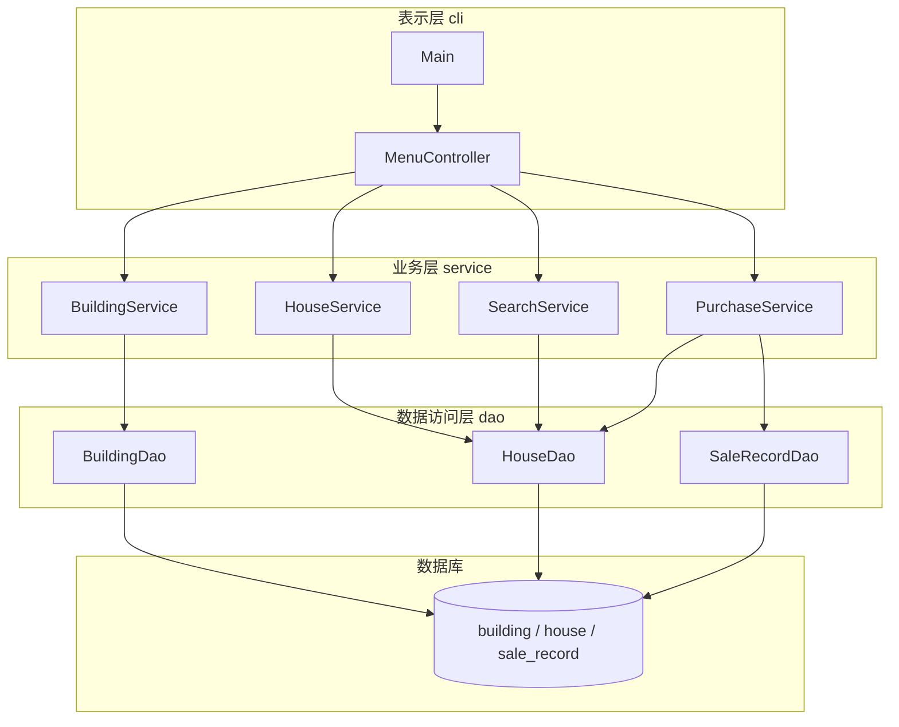
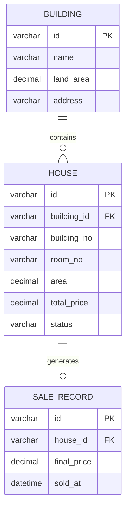
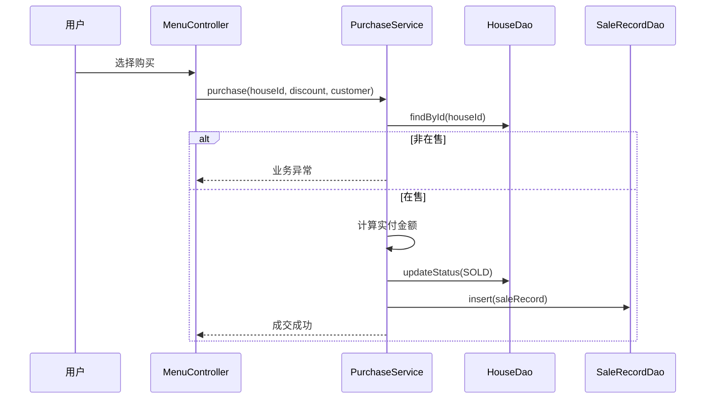

# 概要设计说明书

> **项目名称**：Building ManOS  
> **文档版本**：v0.3  
> **编写**：文档组  
> **日期**：2026-07-13  
> **代码进度**：见 [Java技术框架.md §0](./Java技术框架.md#0-代码实现进度2026-07-13)

---

## 1. 设计目标

在控制台环境下实现房地产公司房屋销售管理，满足课程对 **Java、MySQL、JDBC、分层架构** 的要求；结构清晰、便于分工开发与答辩演示。

---

## 2. 系统总体架构

### 2.1 逻辑分层



### 2.2 包结构

```
com.building.manos
├── Main.java
├── cli/           # 菜单与输入输出
├── service/       # 业务逻辑
├── dao/           # JDBC 数据访问
│   └── impl/
├── model/         # 实体类
├── config/        # 数据库配置
├── discount/      # 折扣策略
└── util/          # 工具类
```

详细类职责见 [Java技术框架.md](./Java技术框架.md)。

### 2.3 调用规则

| 规则 | 说明 |
|------|------|
| cli → service | 表示层只调用业务层 |
| service → dao | 业务层封装规则后调用 dao |
| 禁止 cli → dao | 保证分层边界 |
| 禁止 GUI/Web | 仅控制台交互 |

---

## 3. 模块设计

### 3.1 模块划分

| 模块 | 主要类 | 职责 |
|------|--------|------|
| 楼盘管理 | BuildingService, BuildingDao | 楼盘 CRUD |
| 房屋管理 | HouseService, HouseDao | 房屋 CRUD、总价计算 |
| 房屋查询 | SearchService | 多条件组合查询 |
| 房屋购买 | PurchaseService, SaleRecordDao | 折扣、成交、落库 |
| 折扣 | DiscountStrategy 及实现类 | 可扩展计价规则 |
| 配置 | DBConfig | 读取 `database.properties` / 环境变量 |

### 3.2 主菜单结构

```
主菜单
├── 1. 楼盘管理
├── 2. 房屋管理
├── 3. 房屋查询
├── 4. 房屋购买
├── 5. 销售记录
└── 0. 退出
```

---

## 4. 数据库概要设计

### 4.1 E-R 关系



完整 DDL 与索引见 [数据库设计.md](./数据库设计.md) 与 `sql/schema.sql`。

### 4.2 关键业务约束

- 删除楼盘前检查是否仍有房屋
- 同楼盘下楼号+房号唯一
- 仅 `ON_SALE` 房屋可修改、删除、购买
- 购买成功后 `house.status` → `SOLD`，并插入 `sale_record`

---

## 5. 核心流程设计

### 5.1 房屋购买流程



### 5.2 折扣策略

采用**策略模式**，按房屋**原价档位**自动匹配：

| 原价（元） | 比例折扣 | 满减 |
|------------|----------|------|
| &lt; 100 万 | ×1 | 减 2 万 |
| 100 万 ~ 300 万 | ×0.97 | 减 5 万 |
| ≥ 300 万 | ×0.92 | 减 15 万 |

- 接口：`DiscountStrategy`；实现：`PercentageDiscount` / `ThresholdDiscount`（`PriceTier`）
- `PurchaseService` 在 **JDBC 事务** 内调用 `HouseDao.updateStatusSold(conn,…)` 与 `SaleRecordDao.insert(conn,…)`
- `sale_record.house_id` 有 **唯一约束**（一套房最多一条成交记录）

---

## 6. 接口设计（内部）

本系统为控制台应用，无 HTTP API。层间以 **Java 方法调用** 为接口：

| 层次 | 示例接口 |
|------|----------|
| service | `BuildingService.add(Building b)` |
| service | `PurchaseService.purchase(String houseId, DiscountStrategy, String customer)` |
| dao | `HouseDao.findByPriceRange(min, max, status)` / `updateStatusSold(conn, …)` |

---

## 7. 异常与错误处理

| 场景 | 处理方式 |
|------|----------|
| 输入格式错误 | cli 提示重新输入 |
| 业务规则违反 | service 抛业务异常，cli 友好提示 |
| 数据库连接失败 | 启动或操作时提示检查配置 |
| SQL 异常 | dao 记录后向上抛出，service/cli 统一处理 |

---

## 8. 运行与部署概要

| 项 | 说明 |
|----|------|
| 构建 | Maven，`mvn compile` |
| 运行 | `scripts/run.ps1` 或 `mvn exec:java` |
| 配置 | `src/main/resources/database.properties` |
| 初始化 | 执行 `sql/schema.sql`、`sql/init-data.sql` |

详见 [用户操作手册.md](../user-manual/用户操作手册.md)。

---

## 9. 与详细设计的关系

| 文档 | 内容侧重 |
|------|----------|
| 本文档 | 模块划分、架构、流程、E-R |
| Java技术框架.md | 类图、包职责、代码规范 |
| 数据库设计.md | 表结构、索引、SQL 示例 |
| 代码注释规范.md | JavaDoc 要求 |

---

## 10. 实现进度摘要（2026-07-13）

| 层次 | 进度 |
|------|------|
| config / model / dao / util | ✅ 已完成（陈辉） |
| service / discount | ✅ 已完成（邓单） |
| cli / Main / init-data | ✅ **已完成**（马玉） |

详细类表见 [Java技术框架.md §0](./Java技术框架.md#0-代码实现进度2026-07-13)。

---

## 11. 版本记录

| 版本 | 日期 | 说明 |
|------|------|------|
| v0.1 | 2026-07-10 | 初稿 |
| v0.3 | 2026-07-13 | 同步远程 main：数据层+业务层完成；cli 待办；uk_sale_house |
