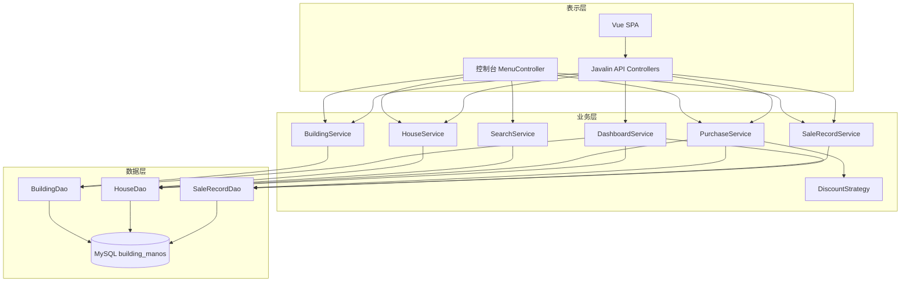
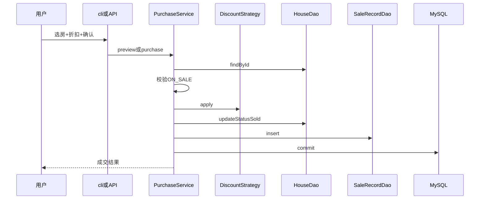
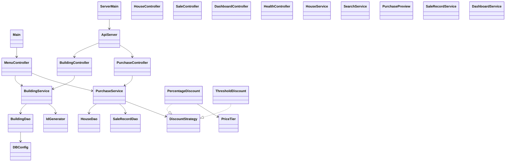
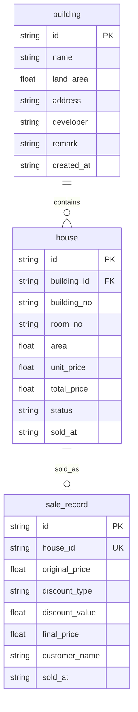
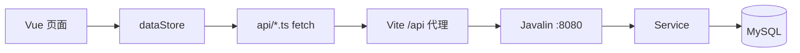

# JAVA 高级编程大作业

**大作业题目：Building ManOS — 房地产公司房屋销售管理系统**

---

| 姓名 | 学号 | 组别 / 角色 |
|------|------|-------------|
| 赵晟闻 | | 组长 |
| 陈辉 | | 技术组 |
| 邓单 | | 技术组 |
| 马玉 | | 技术组 |
| 徐增新 | | 文档组 |
| 韩振 | | 文档组 |
| 仝启瀚 | | 文档组 |
| 王琨璐 | | PPT 组 |
| 栗元启 | | PPT 组 |
| 方安迪 | | PPT 组 |

> 学号请各组员在提交 Word 前自行补全。

**大连理工大学**  
**Dalian University of Technology**

---

> **排版说明（提交 Word 时）**  
> - 正文：**小四号宋体**，1.5 倍行距（推荐）；标题黑体分级  
> - **必须有自动目录**（本 Markdown 提供目录源；粘贴后更新域）  
> - 截图建议目录：`docs/report/images/`  
> - 体例：完整「技术调研 + 项目开发」；内嵌课程要求的类图、数据库、功能、代码思想、界面与分工  
> - 评分：文档与演示约各半；老师已明确**不再强制 PPT 答辩**（PPT 组产出仍可作为辅助材料）

**文档版本**：v3.1｜**日期**：2026-07-14｜**统稿**：文档组（徐增新 / 韩振 / 仝启瀚）｜**技术审核**：技术组 / 组长  
**代码对齐**：cli + Javalin API + Vue 真库；Windows 一键 / Linux systemd；默认不灌库冲数据

---

## 目录

1. [技术调研报告](#1-技术调研报告)  
   - 1.1 [课题背景与调研目标](#11-课题背景与调研目标)  
   - 1.2 [相关技术调研](#12-相关技术调研)  
   - 1.3 [学习总结](#13-学习总结)  
2. [项目开发报告](#2-项目开发报告)  
   - 2.1 [项目简介](#21-项目简介)  
   - 2.2 [需求分析](#22-需求分析)  
   - 2.3 [系统设计过程](#23-系统设计过程)  
   - 2.4 [前端交互介绍（简要）](#24-前端交互介绍简要)  
   - 2.5 [后端 Java 详细介绍](#25-后端-java-详细介绍)  
   - 2.6 [SQL 与数据库详细介绍](#26-sql-与数据库详细介绍)  
   - 2.7 [系统实现与代码思想](#27-系统实现与代码思想)  
   - 2.8 [系统测试](#28-系统测试)  
   - 2.9 [部署与运维](#29-部署与运维)  
   - 2.10 [项目总结](#210-项目总结)  
3. [团队分工](#3-团队分工)  
- [附录](#附录)  
- [参考文献](#参考文献)  
- [版本记录](#版本记录)

---

## 1 技术调研报告

### 1.1 课题背景与调研目标

房地产销售日常需要维护楼盘与房源、快速检索在售单元，并在成交时完成计价与台账登记。本课程大作业要求在 **Java + 数据库 + 分层架构** 约束下交付可演示系统。调研目标包括：

1. 明确课堂 JDBC / 分层写法与本项目工程化改进点；  
2. 论证控制台与「API + Web」双表示层并存的合理性（课程基线 + 体验增强）；  
3. 梳理折扣、事务、唯一成交等业务规则的技术落点；  
4. 形成可协作的仓库规范（Git、文档、脚本、AI 辅助开发约定）。

### 1.2 相关技术调研

#### 1.2.1 技术选型对比

| 方案 | 优点 | 缺点 | 本项目取舍 |
|------|------|------|-----------|
| 纯控制台 + JDBC | 贴合课程、易演示 | 界面表达力弱 | **必做**答辩兜底 |
| Spring Boot + Web | 生态成熟 | 偏离「控制台作业」预期、学习曲线陡 | 不采用 |
| Javalin 轻量 HTTP | 体量小、易嵌入 Maven 工程 | 功能不如 Spring 全 | **可选表示层**采用 |
| 仅文件存储 | 实现快 | 违反「必须用数据库」 | 禁止 |
| Vue 3 + Vite | 组件化、联调友好 | 需额外 Node 环境 | 前端采用，经 `/api` 访问 |

结论：核心业务留在纯 Java 分层；表示层「cli 必备 + API/Vue 加分」，数据统一落 MySQL。

#### 1.2.2 课堂知识映射

| 课堂内容 | 本项目落点 |
|----------|-----------|
| 鲜花商店 entity/dao/service | `model` / `dao` / `service` |
| BaseDao / Properties 配库 | `DBConfig` + `database.properties` |
| PreparedStatement | 全部 Dao |
| 接口 / Buyable | `DiscountStrategy` |
| Scanner 菜单 | `MenuController` + `ConsoleUtils` |
| 异常 try-catch-finally | try-with-resources + 分层异常 |

改进点：表示层**禁止**直接 `new XxxDao()`，保证分层可答辩、可分工。

#### 1.2.3 同类系统功能参考（调研）

调研常见物业/房源管理系统后，抽象本作业最小闭环：**楼盘 → 房屋 → 查询 → 折扣成交 → 台账**。登录权限、多门店、审批流等列为扩展项，避免超纲延误交付。

### 1.3 学习总结

#### 1.3.1 内容简介

本项目为 **Building ManOS** 房屋销售管理系统。组员在开发与协作中系统学习：

**（1）分层架构与 JDBC。** `cli`/`api` → `service` → `dao` → MySQL；`PreparedStatement`、`BigDecimal`、枚举与表字段映射。  

**（2）策略模式与业务事务。** 档位比例/满减折扣；购买同连接 commit/rollback；`uk_sale_house` 唯一约束。  

**（3）前后端解耦与联调。** Javalin 统一 `{code,message,data}`；Vue `dataStore` 真库读写；去掉 Mock 误导文案。  

**（4）工程化与协作。** Maven/JUnit、Git 分支与 `@author`、Windows/Linux 脚本、内网穿透联调、Cursor/码道等 AI 辅助与人工审核结合。  

**（5）文档与答辩表达。** 需求-设计-实现-测试闭环；报告体例对齐完整项目报告结构。

#### 1.3.2 难点和解决办法

**难点一：分层在工程中易滑坡。**  
解决：项目规则 + Code Review；Controller/菜单只调 Service。

**难点二：折扣规则膨胀。**  
解决：`DiscountStrategy` + `PriceTier`；单测覆盖三档边界。

**难点三：购买一致性。**  
解决：JDBC 事务 + 库唯一约束 + 仅 `ON_SALE` 可售。

**难点四：联调数据被脚本冲掉 / 界面像 Mock。**  
解决：默认不执行带 `DELETE` 的 init-data；前端全面走 API；去除「演示模式」文案。

**难点五：本机启动混乱、端口占用、日志不可见。**  
解决：`run.ps1`（Web）/`run-cli.ps1`（控制台）分流；API 窗口取消 `mvn -q`；MySQL 生命周期脚本避免盲目重复启动。

**难点六：多人协作与 Git 门槛。**  
解决：组长辅导 Git；分工表与 `@author` 对齐；文档组分模块统稿。

**难点七：内外网演示。**  
解决：API 绑定 `0.0.0.0`；CORS；内网穿透或服务器 systemd + Nginx（见运维文档）。

#### 1.3.3 学习案例

**案例一：** 鲜花商店 → 规范化分层与购买事务。  
**案例二：** 策略模式落地房价档位折扣。  
**案例三：** cli 成交与 Vue 成交记录交叉验证持久化。  
**案例四：** 健康检查 `db=DOWN` 定位 JDBC 账号（Ubuntu `sudo mysql` 免密 vs 程序密码登录）。

---

## 2 项目开发报告

### 2.1 项目简介

#### 2.1.1 建设目标

为房地产公司提供可演示的房屋销售管理工具：维护楼盘/房源、组合查询、档位折扣成交、成交台账；数据持久化至 MySQL；结构清晰便于分组开发与答辩。

#### 2.1.2 技术栈与交付物

| 类别 | 内容 |
|------|------|
| 语言 / 构建 | Java 17、Maven |
| 数据 | MySQL、JDBC、`mysql-connector-j` |
| 表示 | 控制台 cli；Javalin + Vue 3 |
| 测试 | JUnit 5（约 25 项，可开库全量跑） |
| 脚本 | Windows 一键；Linux `run_server.sh` + systemd |
| 文档 | 需求/设计/测试/手册/**本报告** |

#### 2.1.3 运行环境

| 环境 | 建议版本 |
|------|----------|
| JDK | 17+ |
| Maven | 3.8+ |
| MySQL | 8.0+（兼容 9.x） |
| Node（前端） | 18+（npm/pnpm） |
| OS | Windows 10/11 开发；Ubuntu 服务器部署可选 |

### 2.2 需求分析

#### 2.2.1 用户与角色

本版本为课程简化模型，默认**单一操作员**（管理员与销售合一），无登录模块。

| 角色 | 描述 | 主要操作 |
|------|------|----------|
| 系统操作员 | 公司内部工作人员 | 楼盘/房屋管理、查询、购买、查看成交、查看看板 |

扩展方向：销售员账号、操作审计（本期不做）。

#### 2.2.2 功能模块图



**图2.1 功能模块图**

#### 2.2.3 用例简述

主要用例 **UC-购买房屋**：操作员选定在售房源 → 选择折扣类型 →（可选）预览实付 → 确认客户信息 → 系统事务更新房屋为已售并写入成交记录 → 返回结果。

次要用例：楼盘 CRUD、房屋 CRUD、多条件查询、成交列表、看板查看、健康检查。

#### 2.2.4 需求说明表

| 编号 | 模块 | 详细描述 | 优先级 |
|------|------|---------|--------|
| FR01 | 楼盘管理 | 增删改查；有下属房屋不可删 | P0 |
| FR02 | 房屋管理 | 增删改查；总价=面积×单价；仅在售可改删 | P0 |
| FR03 | 房屋查询 | 楼盘名/楼号/价格/面积/状态 | P0 |
| FR04 | 折扣购买 | 比例/满减；预览+成交；事务 | P0 |
| FR05 | 销售记录 | 列表/按房过滤；一房一成交 | P0 |
| FR06 | 看板/健康检查 | 汇总指标；`/api/health` | P1 |
| FR07 | 双端一致 | cli 与 Web 共享库 | P0 |
| FR08 | 一键与部署 | Windows 脚本；Linux systemd | P1 |

**非功能：** 分层强制性；禁止文件库；金额 `BigDecimal`；JavaDoc；`@author` 与分工表一致。

### 2.3 系统设计过程

#### 2.3.1 总体架构

```
Vue / 控制台
    ↓
api (Javalin) 或 cli
    ↓
service + discount
    ↓
dao (JDBC)
    ↓
MySQL
```

横切：`config`（DBConfig / ServerConfig）、`model`、`util`。

#### 2.3.2 界面设计（UI）

**控制台：** 数字菜单驱动；`ConsoleUtils` 负责输入校验与表格输出。  

```
1 楼盘管理  2 房屋管理  3 房屋查询  4 房屋购买  5 销售记录  0 退出
```

**Web：** 侧栏导航——资产总览、楼盘资产、房源中心、成交工作台、成交记录、系统状态；顶栏全局搜索与快捷创建。数据经 Vite 代理访问 API，界面无 Mock 误导文案。**交互细节见 §2.4**；Java / SQL 细节见 **§2.5～§2.6**。

**图2.2 界面结构示意**（原型截图粘贴处）

#### 2.3.3 流程设计

**购买主流程：**



**图2.3 购买时序图**

#### 2.3.4 主要类设计（课程重点）



**图2.4 主要类图**

| 类 | 主要字段 / 要点 | 作用说明 |
|----|----------------|----------|
| Building | id, name, landArea, address, developer, remark, createdAt | 楼盘实体 |
| House | id, buildingId, buildingNo, roomNo, area, unitPrice, totalPrice, status, soldAt | 房屋实体 |
| SaleRecord | id, houseId, originalPrice, discountType, discountValue, finalPrice, customerName, soldAt | 成交实体 |
| HouseStatus | ON_SALE, SOLD | 状态枚举 |
| DiscountStrategy | apply, getTypeName, getDiscountValue | 折扣接口 |
| PriceTier | 三档区间与参数 | 档位划分 |
| PurchasePreview | 原价/实付/节省/公式等 | 预览 DTO |
| DBConfig | getConnection | JDBC 入口 |
| IdGenerator | B/H/S 前缀 | 业务主键 |
| MenuController | run / 子菜单 | 控制台调度 |
| ApiServer + Controllers | 路由注册 | HTTP 表示层 |
| XxxService / XxxDao | 见框架文档 | 业务与持久化 |

**折扣档位：**

| 原价（元） | 比例 | 满减 |
|------------|------|------|
| &lt; 100 万 | ×1.00 | 减 2 万 |
| [100 万, 300 万) | ×0.97 | 减 5 万 |
| ≥ 300 万 | ×0.92 | 减 15 万 |

#### 2.3.5 数据库设计（课程重点）

| 项 | 规定 |
|----|------|
| 库名 | building_manos |
| 引擎 | InnoDB / utf8mb4 |
| DDL | sql/schema.sql |
| 演示数据 | sql/init-data.sql（含 DELETE，仅 `-InitDb` 时执行） |



**图2.5 E-R 图**（house_id 同时为外键）

**索引与约束要点：**  
- `uk_building_room(building_id, building_no, room_no)`  
- `uk_sale_house(house_id)`  
- 外键 `house.building_id` → `building.id`，`sale_record.house_id` → `house.id`  

**Java 映射约定：** 下划线 ↔ 驼峰；金额 `BigDecimal`；时间 `LocalDateTime`；状态枚举存字符串。

#### 2.3.6 API 设计摘要

统一响应：`{ code, message, data }`，`code=0` 成功。主要路径：`/api/health`、`/api/buildings`、`/api/houses`、`/api/purchases`、`/api/purchases/preview`、`/api/sales`、`/api/dashboard/summary`。详见 `docs/design/API设计.md`。

### 2.4 前端交互介绍（简要）

> 前端为体验增强与联调可视化，业务权威仍在 Java Service + MySQL。本节只做**简明**说明。

#### 2.4.1 技术与工程结构

| 项 | 说明 |
|----|------|
| 框架 | Vue 3 + Vue Router + Vite |
| 目录 | `frontend/src/views` 页面、`api/` 请求封装、`store/dataStore.ts` 状态、`components/` 视觉组件 |
| 联调 | 开发态 Vite 将 `/api` 代理到 `127.0.0.1:8080`；`VITE_API_BASE_URL` 可指向穿透地址 |

#### 2.4.2 页面与路由

| 路由 | 页面 | 主要交互 |
|------|------|----------|
| `/dashboard` | 资产总览 | 展示套数、在售/已售、成交额；楼盘库存分布条 |
| `/buildings` | 楼盘资产 | 搜索筛选；栅格/表格；弹窗新增/编辑；删除确认（有房锁定） |
| `/houses` | 房源中心 | 列表筛选；新增/编辑在售房；删除确认；跳转成交/票据 |
| `/transactions/new` | 成交工作台 | 选在售房 → 选折扣 → **预览**实付 → 填客户 → 确认成交 |
| `/sales` | 成交记录 | 台账列表；可按房屋过滤 |
| `/system` | 系统状态 | 拉取 `/api/health`，展示 API/DB 是否连通；一键重新加载列表 |

侧栏「快捷创建」可带 `?create=1` 直达新建表单；顶栏全局搜索跳转房源中心。

#### 2.4.3 交互与数据流（要点）



1. 进入页面 `onMounted` → `dataStore.loadAll()` 并行请求 buildings/houses/sales；  
2. 保存/删除调用 `saveBuilding` / `removeHouse` 等，成功后再 `loadAll` 刷新；  
3. 成交页先 `discountPreview`，确认后 `purchase`，界面展示回执；  
4. **不存在**业务层 Mock 写入；刷新或重启（不带 `-InitDb`）后数据仍在库中。

**【截图占位】** Web：看板、楼盘编辑弹窗、成交工作台预览、系统状态页。

---

### 2.5 后端 Java 详细介绍

> 本节为课程与答辩重点：分层职责、核心类行为、事务与折扣实现。

#### 2.5.1 包结构与职责边界

```
com.building.manos
├── Main.java                 # cli（默认）或 api 模式入口
├── ServerMain.java           # 仅启动 HTTP API
├── config/                   # DBConfig、ServerConfig
├── model/                    # Building、House、HouseStatus、SaleRecord
├── dao/                      # BuildingDao、HouseDao、SaleRecordDao
├── service/                  # 业务服务 + PurchasePreview
├── discount/                 # DiscountStrategy 及实现、PriceTier
├── cli/                      # MenuController、ConsoleUtils
├── api/                      # ApiServer、Controllers、ApiResponse、dto、DtoMapper
└── util/                     # IdGenerator
```

| 层 | 允许 | 禁止 |
|----|------|------|
| cli / api | 调 service；IO / JSON | 拼 SQL、业务计价 |
| service | 调 dao、discount；开事务 | 直接 DriverManager 拼业务 SQL |
| dao | PreparedStatement、映射 | 折扣规则、菜单逻辑 |
| model | 字段与访问器 | 业务流程 |

#### 2.5.2 配置层

**`DBConfig`：** 读取 `database.properties`；优先环境变量 `DB_URL` / `DB_USER` / `DB_PASSWORD`；`Class.forName` 加载驱动后 `DriverManager.getConnection`。  
**`ServerConfig`：** 读取 `server.properties`（host/port/CORS），支持 `SERVER_HOST` 等覆盖；默认 `0.0.0.0:8080`。

#### 2.5.3 实体层（model）

| 类 | 关键字段 | 说明 |
|----|----------|------|
| Building | id, name, landArea, address, developer, remark, createdAt | 对应 `building` |
| House | id, buildingId, buildingNo, roomNo, area, unitPrice, totalPrice, status, soldAt | 对应 `house`；金额面积一律 `BigDecimal` |
| SaleRecord | id, houseId, originalPrice, discountType, discountValue, finalPrice, customerName, soldAt | 对应 `sale_record` |
| HouseStatus | ON_SALE, SOLD | 存库用 `name()`，读库 `valueOf` |

#### 2.5.4 数据访问层（dao）——详细

共性：`try (Connection; PreparedStatement; ResultSet)`；私有 `mapRow`；业务主键字符串。

**BuildingDao 要点**

| 方法 | SQL 语义 |
|------|----------|
| insert / update / deleteById | 楼盘增改删 |
| findById / findAll | 单条与列表（常按 created_at 排序） |

**HouseDao 要点**

| 方法 | SQL 语义 |
|------|----------|
| insert / update / deleteById | 房屋 CRUD；删除常限 ON_SALE |
| findById / findAll / findByBuildingId | 查询 |
| findByPriceRange / findByAreaRange | 条件查询（与 status 组合） |
| countByBuildingId | 删楼盘前计数 |
| updateStatusSold(id, soldAt) | 乐观限 `status='ON_SALE'` |
| updateStatusSold(Connection, …) / 配合事务 | 供 PurchaseService 共用连接 |

**SaleRecordDao 要点**

| 方法 | SQL 语义 |
|------|----------|
| insert / insert(Connection, …) | 写入成交 |
| findAll / findByHouseId | 台账查询 |

#### 2.5.5 业务层（service）——详细

**BuildingService：** 新增时 `IdGenerator` 生成 `B…`；校验必填；`delete` 前若 `countByBuildingId>0` 则抛 `IllegalArgumentException`。  

**HouseService：** 新增/修改时 `totalPrice = area × unitPrice`（`BigDecimal` 运算）；仅 `ON_SALE` 允许改删。  

**SearchService：** 封装五种查询入口，内部转调 HouseDao（及必要的楼盘名关联逻辑）。  

**SaleRecordService / DashboardService：** 成交列表；看板汇总（楼盘数、房屋数、在售/已售、成交金额等）供 API 使用。  

**PurchaseService（核心）：**

| 方法 | 行为 |
|------|------|
| preview(houseId, type) | 加载在售房 → 建策略 → 算实付/节省/档位文案 → **不写库** |
| purchase(houseId, strategy, customer) | 校验在售 → apply → 开事务 → updateStatusSold + insert → commit |

折扣类型字符串：`PERCENTAGE` / `THRESHOLD`（控制台亦可用编号 1/2 映射）。

#### 2.5.6 折扣子系统（discount）

```java
public interface DiscountStrategy {
    BigDecimal apply(BigDecimal originalPrice);
    String getTypeName();
    BigDecimal getDiscountValue();
}
```

- `PriceTier`：按原价落入 &lt;100万 / 100～300万 / ≥300万，给出 rate 或减免额；  
- `PercentageDiscount`：实付 = 原价 × rate；  
- `ThresholdDiscount`：实付 = max(0, 原价 − 减免额)。  

优点：新增折扣类型只需新实现类，不必改 PurchaseService 主流程。

#### 2.5.7 表示层 Java

**cli：** `MenuController` 主循环 + 子菜单私有方法；`ConsoleUtils` 读 int/decimal/确认/打表；异常捕获后友好提示。  

**api：** `ApiServer` 注册路由与 CORS；各 `*Controller` 解析 JSON → 调 Service → 包进 `ApiResponse`；业务异常映射 40001，未找到 40401，其余 50000；`DtoMapper` 转换驼峰字段。

#### 2.5.8 工具与入口

- `IdGenerator`：`B`/`H`/`S` + 时间戳（或课程约定格式）；  
- `Main`：无参/`cli` → 菜单；`api`/`server` → `ApiServer`；  
- `ServerMain`：部署专用，只起 API。

---

### 2.6 SQL 与数据库详细介绍

#### 2.6.1 库级约定

```sql
CREATE DATABASE IF NOT EXISTS building_manos
    DEFAULT CHARACTER SET utf8mb4
    COLLATE utf8mb4_unicode_ci;
```

选用 **InnoDB**：支持事务与外键，与购买原子性配套。`utf8mb4` 保证中文楼盘名、客户名正常存储。

#### 2.6.2 表结构详解（对照 schema.sql）

**（1）building — 楼盘**

| 列 | 类型 | 约束 | 含义 |
|----|------|------|------|
| id | VARCHAR(32) | PK | 楼盘编号 |
| name | VARCHAR(100) | NOT NULL | 名称 |
| land_area | DECIMAL(12,2) | NOT NULL | 占地面积㎡ |
| address | VARCHAR(200) | NOT NULL | 地址 |
| developer | VARCHAR(100) | 可空 | 开发商 |
| remark | VARCHAR(500) | 可空 | 备注 |
| created_at | DATETIME | 默认 CURRENT_TIMESTAMP | 创建时间 |

**（2）house — 房屋**

| 列 | 类型 | 约束 | 含义 |
|----|------|------|------|
| id | VARCHAR(32) | PK | 房屋编号 |
| building_id | VARCHAR(32) | FK → building.id | 所属楼盘 |
| building_no | VARCHAR(20) | NOT NULL | 楼号 |
| room_no | VARCHAR(20) | NOT NULL | 房号 |
| area | DECIMAL(10,2) | NOT NULL | 面积 |
| unit_price | DECIMAL(12,2) | NOT NULL | 单价 |
| total_price | DECIMAL(14,2) | NOT NULL | 总价（应用层计算后写入） |
| status | VARCHAR(20) | 默认 ON_SALE | ON_SALE / SOLD |
| sold_at | DATETIME | 可空 | 售出时间 |

约束：

- `fk_house_building`：保证房屋必须挂靠存在的楼盘；  
- `uk_building_room (building_id, building_no, room_no)`：同盘同楼同房号唯一。

**（3）sale_record — 成交**

| 列 | 类型 | 约束 | 含义 |
|----|------|------|------|
| id | VARCHAR(32) | PK | 成交编号 |
| house_id | VARCHAR(32) | FK + **UNIQUE** | 房屋；一房一单 |
| original_price | DECIMAL(14,2) | NOT NULL | 原价快照 |
| discount_type | VARCHAR(50) | 可空 | 如 PERCENTAGE |
| discount_value | DECIMAL(10,4) | 可空 | 实际 rate 或减免额 |
| final_price | DECIMAL(14,2) | NOT NULL | 实付 |
| customer_name | VARCHAR(50) | 可空 | 客户 |
| sold_at | DATETIME | 默认当前时间 | 成交时刻 |

约束：`uk_sale_house(house_id)` 从数据库层禁止重复成交。

#### 2.6.3 与 Java 的字段映射

| 表.列 | Java 属性 | 类型 |
|-------|-----------|------|
| land_area | landArea | BigDecimal |
| building_id | buildingId | String |
| unit_price / total_price | unitPrice / totalPrice | BigDecimal |
| status | status | HouseStatus |
| sold_at / created_at | soldAt / createdAt | LocalDateTime |
| discount_type | discountType | String |

Dao 中：`rs.getBigDecimal`、`rs.getTimestamp(...).toLocalDateTime()`、`HouseStatus.valueOf(...)`。

#### 2.6.4 关键 SQL 语义（实现时遵循）

**置已售（防重复售）：**

```sql
UPDATE house
SET status = 'SOLD', sold_at = ?
WHERE id = ? AND status = 'ON_SALE';
```

影响行数为 0 则表示已售或 ID 无效，Service 应失败回滚。

**插入成交：**

```sql
INSERT INTO sale_record
(id, house_id, original_price, discount_type, discount_value, final_price, customer_name, sold_at)
VALUES (?,?,?,?,?,?,?,?);
```

若违反 `uk_sale_house`，数据库抛唯一冲突，事务回滚。

**条件查询示例（价格区间 + 在售）：**

```sql
SELECT * FROM house
WHERE status = ?
  AND total_price BETWEEN ? AND ?
ORDER BY total_price;
```

#### 2.6.5 初始化数据脚本（init-data.sql）

脚本顺序：`DELETE sale_record` → `DELETE house` → `DELETE building` → 再 `INSERT` 演示楼盘/房屋/一条已售样例。  

| 说明 | 内容 |
|------|------|
| 演示楼盘 | 如阳光花园、滨江壹号 |
| 演示在售 | 含 ≥300 万样例房（答辩 92 折） |
| 危险性 | **全表清空**；本地一键**默认不执行**，仅 `-InitDb` 或手工 SOURCE |

#### 2.6.6 事务与隔离（应用层约定）

购买在**同一 Connection** 上关闭 autoCommit，先更新房屋再插成交；任一步失败 `rollback`。结合 InnoDB 行锁与 `WHERE status='ON_SALE'`，降低并发双售风险。课程环境默认隔离级别即可，无需单独改全局隔离配置。

---

### 2.7 系统实现与代码思想

#### 2.7.1 实现效果总览

| 能力 | 说明 | 截图占位 |
|------|------|----------|
| 控制台五菜单 | 全流程可键盘完成 | 【截图 1】主菜单 |
| Web 看板与 CRUD | 真库读写 | 【截图 2～3】 |
| 成交工作台 | 预览+购买 | 【截图 4】 |
| 成交记录 / 系统状态 | 台账与 health | 【截图 5～6】 |
| 一键启动 | API 日志窗口 | 【截图 7】 |

#### 2.7.2 代码思想精要（课程表述）

**分层与公用类：** `ConsoleUtils`、`DBConfig`、`IdGenerator`、`ApiResponse`、`DtoMapper`。  

**策略模式：** 见 §2.5.6。  

**购买事务：**

```java
conn.setAutoCommit(false);
try {
    houseDao.updateStatusSold(conn, houseId, now);
    saleRecordDao.insert(conn, record);
    conn.commit();
} catch (Exception e) {
    conn.rollback();
    throw e;
}
```

**泛型集合：** 查询统一 `List<T>` + `ArrayList`。  

**配置覆盖：** 环境变量优先，便于本机 `tarena` 与服务器独立账号分流。

#### 2.7.3 工程目录（节选）

```
com.building.manos / frontend/ / sql/ / scripts/
```

### 2.8 系统测试

#### 2.8.1 测试策略

| 层级 | 方式 | 说明 |
|------|------|------|
| 单元 | JUnit | 折扣、IdGenerator 等 |
| 集成 | JUnit + MySQL | Dao / Service（`RUN_DB_TESTS=true`） |
| 功能 | 手工 / 脚本 | 菜单与 Web 走查 |
| 联调 | health + 购买全路径 | cli ↔ Web 交叉验证 |

全量自动化约 **25/25**（本机库就绪时）。

#### 2.8.2 测试用例表（摘要）

| 编号 | 测试项 | 步骤要点 | 预期 | 结果 |
|------|--------|----------|------|------|
| T01 | 新增楼盘 | 填写合法字段 | 列表可见 | 通过 |
| T02 | 删非空楼盘 | 楼盘仍有房屋 | 拒绝删除 | 通过 |
| T03 | 新增房屋总价 | 面积×单价 | 自动计算 | 通过 |
| T04 | 改已售房屋 | 状态 SOLD | 拒绝 | 通过 |
| T05 | 按状态查在售 | 查询 ON_SALE | 列表正确 | 通过 |
| T06 | ≥300 万比例购 | H202607130003 等 | 约 92 折落库 | 通过 |
| T07 | 重复购买 | 再买已售 | 拒绝 | 通过 |
| T08 | Web 增改后重启 | 不带 -InitDb | 数据仍在 | 通过 |
| T09 | health | GET /api/health | db=UP | 通过 |
| T10 | 非法菜单输入 | 乱输选项 | 提示重试 | 通过 |

更全表格见 `docs/test/测试用例.md`。

### 2.9 部署与运维

#### 2.9.1 本机（Windows）

```powershell
# Web + API + 浏览器（推荐）
./scripts/run.ps1

# 仅控制台
./scripts/run-cli.ps1

# 危险：清空并灌演示数据
./scripts/run.ps1 -InitDb
```

API 日志在独立 PowerShell 窗口；默认 JDBC 可用环境变量覆盖。

#### 2.9.2 服务器（Linux）

```bash
./scripts/run_server.sh          # 编译 + systemd building-manos-api
# 可选：Nginx 托管 frontend/dist，反代 /api
```

详见 `docs/ops/Linux服务器部署.md`、`docs/ops/内网穿透说明.md`。

#### 2.9.3 安全注意

- 勿对公网开放 3306；  
- 生产使用独立 DB 用户与强密码；  
- 仓库 properties 仅为模板/课程机约定，服务器用环境变量覆盖。

### 2.10 项目总结

#### 2.10.1 完成情况

完成楼盘/房屋/查询/档位折扣购买/成交台账；cli 与 API/Vue 双通道；JDBC 事务与唯一约束；自动化测试与一键/常驻部署；文档体系以本报告为终稿。

#### 2.10.2 不足与展望

- 无登录与权限模型；  
- 统计报表、导出、移动端适配仍弱；  
- GPU/重前端特效非本课题重点，UI 可持续打磨；  
- 可引入连接池、更完整的 API 鉴权（课程外加分项）。

#### 2.10.3 收获

组员在分层、事务、接口设计、前后端联调、Git 协作与文档表达方面得到综合训练；AI 辅助提效，但关键业务与提交材料均经人工核对。

---

## 3 团队分工

> 本组为**多人协作**；答辩不强制 PPT，但 PPT 组仍完成视觉材料以备需要。以下为实际分工。

### 3.1 组织架构

| 组别 | 成员 |
|------|------|
| 组长 | 赵晟闻 |
| 技术组 | 陈辉、邓单、马玉 |
| 文档组 | 徐增新、韩振、仝启瀚 |
| PPT 组 | 王琨璐、栗元启、方安迪 |

### 3.2 成员工作量说明

#### 组长

**赵晟闻：** 下发分工任务；负责答辩；对齐各组进度；初步起草大作业文档内容；指导同学 Git 使用；适配前端/控制台与后端的本地回环交互；适配前后端上线与内网穿透联调。

#### 技术组

**陈辉：** 负责数据持久化底座，完成实体与 Dao、连接配置及主键工具，保证 JDBC / `PreparedStatement` 与表约束落地，并使用码道智能体完成前端适配相关工作。

**邓单：** 负责业务规则与折扣策略，实现查询与购买事务，使「计价 + 成交落库」可测试、可演示。

**马玉：** 负责控制台交互，完成菜单编排与输入工具类，使评委无需了解 Maven 细节即可走完核心业务演示。

#### 文档组

**徐增新、韩振、仝启瀚：** 统筹需求分析、概要/数据库设计、测试用例与用户手册等材料；共同完成符合模板的《大作业报告》统稿、目录与图表占位及后续丰满修订。

#### PPT 组

**王琨璐：** 制作 PPT 框架与模板。  

**栗元启：** 制作 PPT 图标、矢量图与位图展示素材。  

**方安迪：** 制作 PPT 视觉输出（版式与观感整体把控）。

### 3.3 工作量矩阵（便于评分查阅）

| 成员 | 主要产出 | 对应仓库路径 / 材料 |
|------|----------|---------------------|
| 赵晟闻 | 统筹、答辩、联调与穿透、文档起草 | 全库进度、`docs/` 初稿、演示链路 |
| 陈辉 | 数据层 + 前端适配协助 | `config`/`model`/`dao`/`util`、前端相关 |
| 邓单 | 业务与折扣 | `service`/`discount`、相关测试 |
| 马玉 | 控制台 | `cli`、`Main` |
| 徐增新 / 韩振 / 仝启瀚 | 文档与报告 | `docs/**`、本报告 |
| 王琨璐 / 栗元启 / 方安迪 | PPT 视觉 | `ppt/**` |

### 3.4 协作机制

- 以 GitHub 仓库为唯一代码与文档源；  
- `@author` 与本分工表一致；  
- 技术口径以 `docs/design/Java技术框架.md` §0 为准；  
- 例会由组长对齐进度与风险（库账号、端口、灌库策略等）。

---

## 附录

| 附录 | 内容 |
|------|------|
| A | sql/schema.sql、sql/init-data.sql |
| B | Java技术框架.md、API设计.md、概要设计.md |
| C | 数据库设计.md、数据字典.md |
| D | 测试用例.md |
| E | 用户操作手册.md、Linux服务器部署.md、内网穿透说明.md |
| F | 团队分工表.md（可与本章对照） |

---

## 参考文献

1. 大连理工大学《JAVA 高级编程》课程讲义与 `examples/` 课堂示例  
2. Oracle Java 17 Documentation  
3. MySQL 8.0 / 9.x Reference Manual  
4. Javalin、Vue 3 官方文档  
5. 本仓库 docs/design、docs/requirements、docs/test  
6. 完整项目报告体例参考（技术调研 + 项目开发结构）

---

## 版本记录

| 版本 | 日期 | 说明 |
|------|------|------|
| v1.x | 2026-07-14 | 老师六章提纲初稿与代码对齐 |
| v2.0 | 2026-07-14 | 改为「调研+开发」完整体例 |
| v3.0 | 2026-07-14 | **大幅丰满**：拓展调研/需求/部署等目录；写入十人团队真实分工 |
| v3.1 | 2026-07-14 | 增补 **前端交互（简）**、**后端 Java 详细**、**SQL 详细** 专章 |
