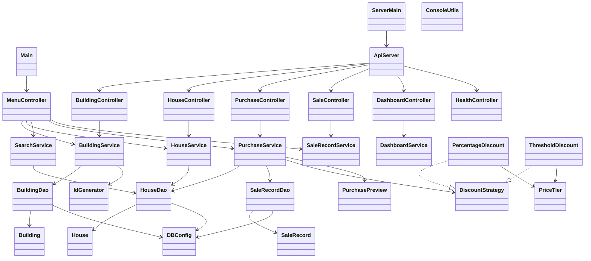
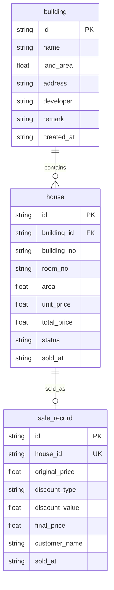
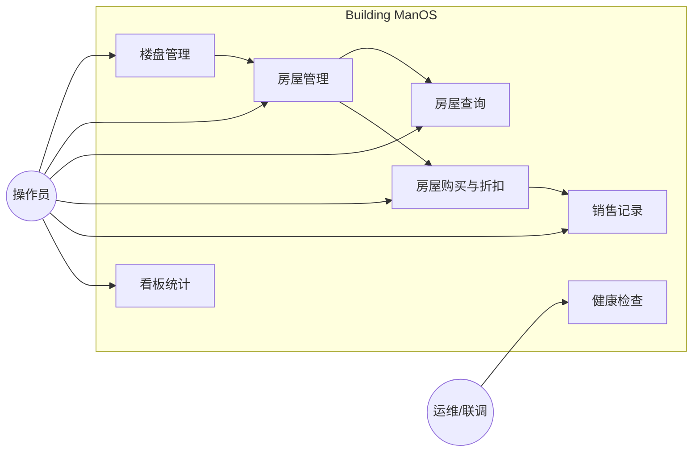
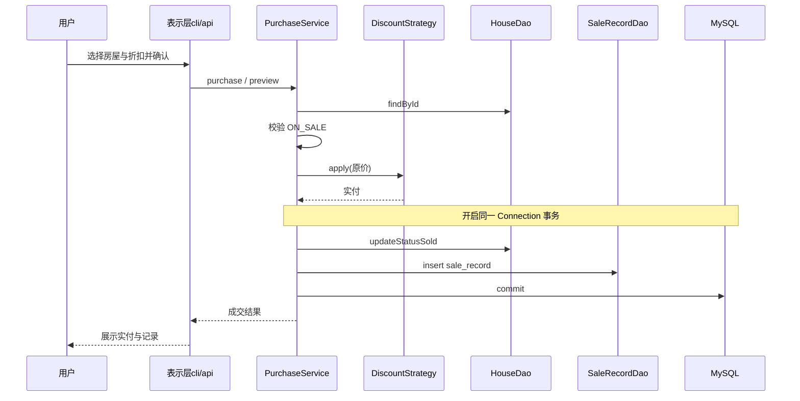

# JAVA 高级编程大作业

**大作业题目：Building ManOS — 房地产公司房屋销售管理系统**

---

| 姓名：_______________ | 学号：_______________ |
|-----------------------|-----------------------|
| 姓名：_______________ | 学号：_______________ |
| 姓名：_______________ | 学号：_______________ |
| 姓名：_______________ | 学号：_______________ |
| 姓名：_______________ | 学号：_______________ |

> 已知技术成员可填：陈辉、邓单、马玉（学号待补）；文档组/其余成员请在提交前补全。

**大连理工大学**  
**Dalian University of Technology**

---

> **排版说明（提交 Word 时）**  
> - 正文：**小四号宋体**，1.5 倍行距（推荐）  
> - 标题：黑体分级；英文与代码可用 Consolas / 等宽字体  
> - **必须保留自动目录**（本 Markdown 提供目录源；粘贴 Word 后请更新域）  
> - 第 5 章截图：请按提示从本机运行界面另行粘贴（路径建议 `docs/report/images/`）  
> - 本文综合了技术组、文档组既有材料（Java 技术框架、数据库设计、概要设计、API 设计、测试用例、用户手册、Linux 部署说明等），为课程评分用**终稿报告**。  
> - 评分权重提示：文档撰写与项目演示各占一半；**不再要求 PPT 答辩**。

**文档版本**：v1.1｜**日期**：2026-07-14｜**编写**：文档组（统稿）／技术组（内容审核）  
**代码对齐**：本地 `main`（含 Javalin API、Vue 真库联调、一键脚本、Linux systemd 部署；前端已去除 Mock 文案）

---

## 目录

1. [系统主要的类图](#1-系统主要的类图)  
2. [系统数据库设计](#2-系统数据库设计)  
3. [主要功能设计](#3-主要功能设计)  
4. [主要代码设计](#4-主要代码设计)  
5. [实现界面](#5-实现界面)  
6. [团队分工](#6-团队分工)  
- [附录](#附录)  
- [参考文献](#参考文献)  
- [版本记录](#版本记录)

---

## 摘要

本项目面向房地产公司房屋销售管理场景，设计并实现了 **Building ManOS** 系统。核心技术栈为 **Java 17 + Maven + MySQL + JDBC**，严格采用 **表示层 → 业务层 → 数据访问层 → 数据库** 的分层架构。表示层双通道并行：**(1)** 控制台菜单（`cli`，答辩兜底）；**(2)** **Javalin HTTP API + Vue 3 SPA**（`api` / `frontend`），前端经 `/api` **读写同一套 MySQL**，业务路径已不再依赖浏览器内存 Mock。功能覆盖楼盘与房屋 CRUD、多条件查询、原价三档比例/满减折扣购买、折扣预览、成交记录、看板统计与健康检查；购买使用 JDBC 事务，并有 `uk_sale_house` 唯一约束防重复成交。交付上支持 Windows 一键联调（`run.ps1` / `run_building_os`）、Linux `run_server.sh` + systemd 常驻，以及完整课程文档（本报告为提交终稿）。

**关键词**：Java；MySQL；JDBC；分层架构；策略模式；Javalin；Vue；房屋销售管理

---

## 1. 系统主要的类图

### 1.1 总体包结构与分层类图

根包：`com.building.manos`。主要分层如下（示意类图，可导出为 PNG 插入 Word）：



**作用说明**：`cli` / `api` 只做交互与协议转换；`service` 承载业务；`dao` 专职 JDBC；`discount` 策略计价；Vue 经 HTTP 调用 `api`，与 cli 共用 service/dao。

---

### 1.2 实体类（model）字段与作用

#### 1.2.1 `Building`（楼盘）

| 字段 | 类型 | 属性/可见性 | 含义 |
|------|------|-------------|------|
| `id` | `String` | private | 楼盘主键，如 `B` + 时间戳 |
| `name` | `String` | private | 楼盘名称 |
| `landArea` | `BigDecimal` | private | 占地面积（㎡） |
| `address` | `String` | private | 地址 |
| `developer` | `String` | private | 开发商，可空 |
| `remark` | `String` | private | 备注，可空 |
| `createdAt` | `LocalDateTime` | private | 创建时间 |

**作用**：对应表 `building`，是房屋的归属主体。业务层删除楼盘前须校验其下是否仍有房屋。

#### 1.2.2 `House`（房屋）

| 字段 | 类型 | 属性/可见性 | 含义 |
|------|------|-------------|------|
| `id` | `String` | private | 房屋主键，如 `H` + 时间戳 |
| `buildingId` | `String` | private | 所属楼盘 ID（外键） |
| `buildingNo` | `String` | private | 楼号（如 `3栋`） |
| `roomNo` | `String` | private | 房号（如 `1201`） |
| `area` | `BigDecimal` | private | 建筑面积（㎡） |
| `unitPrice` | `BigDecimal` | private | 单价（元/㎡） |
| `totalPrice` | `BigDecimal` | private | 总价 = 面积 × 单价 |
| `status` | `HouseStatus` | private | `ON_SALE` / `SOLD` |
| `soldAt` | `LocalDateTime` | private | 售出时间，在售为空 |

**作用**：核心业务对象。仅在售可改删买；购妥后状态置已售。

#### 1.2.3 `HouseStatus`（枚举）

| 常量 | 含义 |
|------|------|
| `ON_SALE` | 在售 |
| `SOLD` | 已售 |

**作用**：避免魔法字符串，dao 与库之间用 `name()` / `valueOf()` 映射。

#### 1.2.4 `SaleRecord`（成交记录）

| 字段 | 类型 | 属性/可见性 | 含义 |
|------|------|-------------|------|
| `id` | `String` | private | 成交主键，如 `S` + 时间戳 |
| `houseId` | `String` | private | 房屋 ID（唯一） |
| `originalPrice` | `BigDecimal` | private | 成交原价 |
| `discountType` | `String` | private | 如 `PERCENTAGE` / `THRESHOLD` |
| `discountValue` | `BigDecimal` | private | 实际使用的折扣率或满减额 |
| `finalPrice` | `BigDecimal` | private | 实付金额 |
| `customerName` | `String` | private | 客户姓名 |
| `soldAt` | `LocalDateTime` | private | 成交时间 |

**作用**：购买成功后的审计与查询依据；数据库层用 `uk_sale_house` 保证「一套房一条成交」。

---

### 1.3 配置与工具类

#### 1.3.1 `DBConfig`

| 要点 | 说明 |
|------|------|
| 职责 | 读取 `database.properties`（及环境变量覆盖），提供 `getConnection()` |
| 关键成员 | 通常为静态工具类，无私有业务状态 |
| 设计思想 | 对齐课堂 `BaseDao` 的连接职责，但把 SQL 留在各 Dao |

#### 1.3.2 `ServerConfig`

| 要点 | 说明 |
|------|------|
| 职责 | 读取 `server.properties`：`host`/`port`/CORS |
| 用途 | 供 `ApiServer` 绑定 `0.0.0.0:8080` 等 |

#### 1.3.3 `IdGenerator`

| 要点 | 说明 |
|------|------|
| 职责 | 生成 `B…` / `H…` / `S…` 前缀业务主键 |
| 作用 | 统一主键风格，避免业务层手写拼串 |

---

### 1.4 数据访问层（dao）

| 类 | 主要方法（摘要） | 作用 |
|----|------------------|------|
| `BuildingDao` | `insert` / `findById` / `findAll` / `update` / `deleteById` | 楼盘表 CRUD |
| `HouseDao` | CRUD；`findByBuildingId`；价格/面积区间查询；`updateStatusSold(Connection,…)`；`findAll` | 房屋持久化与条件查询；支持事务连接重载 |
| `SaleRecordDao` | `insert` / `insert(Connection,…)` / `findAll` / `findByHouseId` | 成交写入与查询 |

**共性设计**：

- 一律 `PreparedStatement`，禁止字符串拼 SQL；  
- `try-with-resources` 关闭连接；  
- ResultSet → model 映射集中在 Dao 私有方法；金额用 `BigDecimal`。

---

### 1.5 业务层（service）与折扣策略

| 类 | 作用 |
|----|------|
| `BuildingService` | 楼盘业务校验；删除前统计下属房屋 |
| `HouseService` | 新增时计算总价；仅在售可改删；列表 |
| `SearchService` | 按楼盘名、楼号、价格、面积、状态查询 |
| `PurchaseService` | 预览与购买；调用折扣策略；JDBC 事务落库 |
| `PurchasePreview` | 预览结果载体（原价、实付、节省、档位说明、公式等） |
| `SaleRecordService` | 成交列表 / 按房查询 |
| `DashboardService` | 看板汇总（套数、在售/已售、成交金额等） |

**折扣子系统**：

| 类 | 字段/要点 | 作用 |
|----|-----------|------|
| `DiscountStrategy` | 接口：`apply` / `getTypeName` / `getDiscountValue` | 策略抽象 |
| `PriceTier` | 按原价划分三档（包内） | 统一档位阈值 |
| `PercentageDiscount` | 实现接口 | 原价 × 档位比例 |
| `ThresholdDiscount` | 实现接口 | 原价 − 档位满减额 |

**档位规则**：

| 原价（元） | 比例折扣 | 满减 |
|------------|----------|------|
| &lt; 100 万 | ×1.00 | 减 2 万 |
| 100 万 ≤ 原价 &lt; 300 万 | ×0.97 | 减 5 万 |
| ≥ 300 万 | ×0.92 | 减 15 万 |

---

### 1.6 表示层：控制台（cli）

| 类 | 作用 |
|----|------|
| `Main` | 入口；参数 `cli`（默认）或 `api`/`server` |
| `MenuController` | 主菜单循环与子菜单，**只调 service** |
| `ConsoleUtils` | 读行/整数/小数、确认、表格打印 |

本地启动：`scripts/run-cli.ps1`（Windows）或 `scripts/run_cli.sh`（Linux）。

---

### 1.7 表示层：HTTP API（api）+ Vue

| 类 / 目录 | 作用 |
|-----------|------|
| `ServerMain` | API 进程入口（`0.0.0.0:8080`） |
| `ApiServer` | 注册路由、CORS、异常 → `ApiResponse` |
| `Building/House/Purchase/Sale/Dashboard/HealthController` | REST 资源 |
| `DtoMapper`、`*Request` | JSON 契约与实体映射 |
| `frontend/` | Vue 3：`api/*` + `dataStore` 调真接口；页面含看板、楼盘、房屋、成交工作台、成交记录、系统状态 |

主要 API：`/api/health`、`/api/buildings`、`/api/houses`、`/api/purchases(/preview)`、`/api/sales`、`/api/dashboard/summary`（详见 `docs/design/API设计.md`）。

---

## 2. 系统数据库设计

### 2.1 设计目标与库参数

| 项 | 规定 |
|----|------|
| 库名 | `building_manos` |
| 引擎 | InnoDB |
| 字符集 | utf8mb4 |
| 访问方式 | 仅 dao 层 JDBC；禁止 cli/service 直连 |
| DDL / 数据 | `sql/schema.sql`、`sql/init-data.sql` |

### 2.2 E-R 图



**关系说明**：

1. 一个楼盘包含多套房屋（1:N）；  
2. 一套房屋最多对应一条成交记录（1:0..1，业务简化 + 唯一约束）；  
3. 删除楼盘前，业务层检查房屋是否清空，并以外键约束兜底。

### 2.3 表结构详细说明

#### 表 `building`（楼盘）

| 列名 | 类型 | 空 | 说明 |
|------|------|----|------|
| id | VARCHAR(32) | N | 主键 |
| name | VARCHAR(100) | N | 楼盘名称 |
| land_area | DECIMAL(12,2) | N | 占地面积 |
| address | VARCHAR(200) | N | 地址 |
| developer | VARCHAR(100) | Y | 开发商 |
| remark | VARCHAR(500) | Y | 备注 |
| created_at | DATETIME | Y | 默认当前时间 |

#### 表 `house`（房屋）

| 列名 | 类型 | 空 | 说明 |
|------|------|----|------|
| id | VARCHAR(32) | N | 主键 |
| building_id | VARCHAR(32) | N | FK → building.id |
| building_no | VARCHAR(20) | N | 楼号 |
| room_no | VARCHAR(20) | N | 房号 |
| area | DECIMAL(10,2) | N | 面积 |
| unit_price | DECIMAL(12,2) | N | 单价 |
| total_price | DECIMAL(14,2) | N | 总价 |
| status | VARCHAR(20) | N | ON_SALE / SOLD |
| sold_at | DATETIME | Y | 售出时间 |

**约束**：`uk_building_room(building_id, building_no, room_no)` 保证同楼盘房号不重复；`fk_house_building` 外键。

#### 表 `sale_record`（成交）

| 列名 | 类型 | 空 | 说明 |
|------|------|----|------|
| id | VARCHAR(32) | N | 主键 |
| house_id | VARCHAR(32) | N | FK → house.id，且 **UNIQUE** |
| original_price | DECIMAL(14,2) | N | 原价 |
| discount_type | VARCHAR(50) | Y | 折扣类型 |
| discount_value | DECIMAL(10,4) | Y | 折扣参数 |
| final_price | DECIMAL(14,2) | N | 实付 |
| customer_name | VARCHAR(50) | Y | 客户 |
| sold_at | DATETIME | Y | 成交时间 |

### 2.4 逻辑设计要点（与 Java 映射）

| 约定 | 说明 |
|------|------|
| 命名 | DB 下划线 ↔ Java 驼峰，Dao 负责映射 |
| 金额/面积 | 统一 `BigDecimal`，避免浮点误差 |
| 时间 | `LocalDateTime` ↔ `TIMESTAMP` |
| 状态 | 枚举存库为字符串 |
| 事务 | 购房：更新 `house` + 插入 `sale_record` 同连接提交/回滚 |

---

## 3. 主要功能设计

### 3.1 功能总览框图



### 3.2 各功能模块说明

| 模块 | 功能要点 |
|------|----------|
| **楼盘管理** | 新增、修改、删除、列表；删除须无下属房屋 |
| **房屋管理** | 新增（自动算总价）、修改/删除（仅在售）、按楼盘/全量列表 |
| **房屋查询** | 按楼盘名称、楼号、价格区间、面积区间、销售状态 |
| **房屋购买** | 选择在售房 → 选折扣类型 → 预览实付 → 确认成交；事务更新状态并写成交 |
| **销售记录** | 列表查看；可按房屋过滤 |
| **看板统计** |（Web/API）汇总套数、在售/已售、成交金额等 |
| **双表示层** | cli 菜单全功能；Vue（资产总览/楼盘/房源/成交工作台/成交记录/系统状态）经 REST 操作同一套数据 |
| **运维脚本** | Windows：`run.ps1` 一键（API+前端+浏览器）；Linux：`run_server.sh` + systemd 常驻 |
| **数据安全** | 一键启动**默认不**执行会清空表的 `init-data.sql`；仅 `-InitDb` 才重置演示数据 |

### 3.3 控制台主菜单结构

```
主菜单
├── 1. 楼盘管理（增删改查）
├── 2. 房屋管理（增删改查）
├── 3. 房屋查询（多条件）
├── 4. 房屋购买（折扣 + 成交）
├── 5. 销售记录
└── 0. 退出
```

### 3.4 Web 功能导航（当前前端）

```
Vue SPA
├── 资产总览（看板指标 / 楼盘库存分布）
├── 楼盘资产（CRUD，写入 MySQL）
├── 房源中心（CRUD / 筛选）
├── 成交工作台（折扣预览 + 确认购买）
├── 成交记录
└── 系统状态（/api/health，db UP/DOWN）
```

### 3.5 核心业务流程：购买



---

## 4. 主要代码设计

> 本节按课程要求：**不大量粘贴代码**，重点写明设计思想、模式与精妙处，并列出**关键片段示意**。

### 4.1 分层思想（精妙处之一）

| 层次 | 允许 | 禁止 |
|------|------|------|
| cli / api | 调 service；做 IO / JSON | 拼 SQL、new Dao 做业务 |
| service | 调 dao、discount；事务与校验 | 直接 JDBC SQL |
| dao | PreparedStatement、映射 | 折扣/菜单逻辑 |
| model | Getter/Setter | 业务规则 |

这样实现后：控制台与 Vue **共用业务层**，改折扣规则只需动 `discount`/`PurchaseService`，两端同时生效。

### 4.2 接口与策略模式（精妙处之二）

`DiscountStrategy` 接口使「比例折扣」与「满减」可互换注入：

```java
public interface DiscountStrategy {
    BigDecimal apply(BigDecimal originalPrice);
    String getTypeName();
    BigDecimal getDiscountValue();
}
```

`PriceTier` 集中维护三档阈值，两套实现共用，避免在 service 写 if-else 丛林。购买处只依赖接口：

```java
// PurchaseService 中（示意）
BigDecimal finalPrice = strategy.apply(house.getTotalPrice());
```

这与课堂「面向接口编程 / Buyable」一脉相承，并落到真实计价业务。

### 4.3 泛型集合的使用

- Dao / Service 查询一律返回 `List<Building>`、`List<House>`、`List<SaleRecord>`；  
- 内部多用 `ArrayList` 承接 ResultSet 行；  
- cli 打印表格时使用 `List<String[]>` 等轻量结构；  
- 金额统一 `BigDecimal`，避免 `double` 精度问题。

示意：

```java
List<House> houses = new ArrayList<>();
while (rs.next()) {
    houses.add(mapRow(rs));
}
return houses;
```

### 4.4 公用类与工具复用

| 公用类 | 被谁用 | 价值 |
|--------|--------|------|
| `ConsoleUtils` | MenuController 各子菜单 | 输入校验、重试、统一表格输出 |
| `DBConfig` | 全部 Dao | 连接入口单一 |
| `IdGenerator` | 各 Service 新增 | 主键规则一致 |
| `ApiResponse` | 全部 Controller | 前后端错误码一致 |
| `DtoMapper` | api 层 | 隔离实体与 JSON 契约 |

### 4.5 JDBC 与事务（精妙处之三）

购买过程在同一 `Connection` 上关闭自动提交，先更新房屋状态，再插入成交；任一步失败则回滚，避免「已售却无记录」或「有记录却仍在售」。

```java
conn.setAutoCommit(false);
try {
    houseDao.updateStatusSold(conn, houseId, now);
    saleRecordDao.insert(conn, record);
    conn.commit();
} catch (Exception e) {
    conn.rollback();
    throw e;
}
```

配合库表 `uk_sale_house`，从**业务 + 数据库**双侧防止重复成交。

### 4.6 HTTP 表示层与持久化要点

- 统一响应：`code=0` 成功，`40001` 业务失败，`40401` 不存在，`50000` 服务端异常；  
- Controller 薄、Service 厚；CORS + `host=0.0.0.0`；  
- 前端 `dataStore` / `api/*` 全部走真实 HTTP，侧栏与页面已去除「Mock / 演示 / 不连接后端」文案；  
- **一键脚本默认不灌 `init-data`**：避免重启后用 DELETE 冲掉用户刚写入的数据；需要演示样例时再 `-InitDb`。

### 4.7 异常处理分层

| 层 | 策略 |
|----|------|
| cli | 捕获后友好打印，引导重输 |
| api | 映射为统一 JSON 错误码 |
| service | `IllegalArgumentException` 表达业务拒绝 |
| dao | `SQLException` 上抛或包装 |

### 4.8 测试与运维设计

- 折扣纯单元测试；Dao/Service 集成测试（`RUN_DB_TESTS=true`，约 25 项）；  
- Windows：`scripts/run.ps1` 拉起 MySQL（如需）+ API（独立窗口打 Java 日志）+ Vite + 浏览器；  
- Linux：`scripts/run_server.sh` 编译依赖并注册 `building-manos-api` systemd；细则见 `docs/ops/Linux服务器部署.md`。

---

## 5. 实现界面

> **说明**：以下按**完整运行流程**描述界面。请将本机截图插入对应小节（建议目录 `docs/report/images/`）。控制台与 Web 任选一条主演示路径即可，另一条可作为补充。

### 5.1 环境准备与启动

1. 启动 / 配置 MySQL；`database.properties` 与本机一致（课程机常用 `root`/`tarena`，也可用环境变量 `DB_PASSWORD` 覆盖）。  
2. **首次**建库或需要重置演示数据时：`powershell -File scripts/run_building_os.ps1 -InitDb`（会清空业务表后灌样例）。日常联调**不要**带 `-InitDb`。  
3. **Web 联调（推荐日常）**：

```powershell
./scripts/run.ps1
# 或 .\run_building_os.cmd
```

会启动 API（独立窗口可见 Java 日志）、前端 Vite，并打开 `http://127.0.0.1:5173/`。按 Enter 可收尾子进程。  

4. **控制台答辩兜底**：

```powershell
powershell -File scripts/run-cli.ps1
```

5. **Linux 常驻 API**：`./scripts/run_server.sh`（systemd `building-manos-api`），可选 Nginx 托管 `frontend/dist`。

**【截图 5-1】数据库配置 / 建库成功提示**  
（粘贴位置）

**【截图 5-2】程序启动成功画面**  
（cli：主菜单；或 Web：系统首页/看板）

### 5.2 流程 A：控制台完整演示（答辩兜底）

按 `run-cli.ps1` 进入主菜单后：

#### 步骤 1：进入主菜单
**【截图 5-3】主菜单**

#### 步骤 2：楼盘管理 — 查看列表
**【截图 5-4】楼盘列表**

#### 步骤 3：房屋查询 — 按状态查「在售」
**【截图 5-5】在售房屋列表**

#### 步骤 4：房屋购买 — 档位比例折扣  
选 ≥300 万在售房（如 `H202607130003`）→ 比例折扣 → 客户姓名 → 确认（约 92 折）。  
**【截图 5-6】购买确认 / 成交成功**

#### 步骤 5：已售状态与销售记录  
**【截图 5-7】已售状态**　**【截图 5-8】销售记录**

### 5.3 流程 B：Web 前端完整演示（主推荐）

| 步骤 | 页面 | 说明 |
|------|------|------|
| 1 | 系统状态 / 看板 | `/api/health` 显示 `db=UP`；看板数字来自库 |
| 2 | 楼盘资产 | 新增/修改后刷新仍在（已写入 MySQL） |
| 3 | 房源中心 | 状态徽章、删除提示为数据库操作 |
| 4 | 成交工作台 | 预览折扣 → 确认成交 |
| 5 | 成交记录 | 可见新票据 |

**【截图 5-9～5-12】** 看板 / 楼盘 / 交易 / 成交记录  

> 界面已无「Mock 演示 / 不连接后端」横幅；侧栏为「系统状态 · API/MySQL 联调」。

### 5.4 界面与数据一致性说明

无论 cli 或 Web，购买成功后均可在另一通道查到同一 `sale_record`。重启服务（**不带** `-InitDb`）后数据仍在，证明持久化在 MySQL，而非仅停留在页面内存。

---

## 6. 团队分工

> 评分关注「每人工作量是否说清」。下表按仓库 `@author` 与模块归属整理；**姓名学号请在封面补全**。

### 6.1 小组成员（提交前填写）

| 序号 | 姓名 | 学号 | 所在组 / 角色 |
|------|------|------|----------------|
| 1 | 陈辉 | | 技术组 · 数据层 |
| 2 | 邓单 | | 技术组 · 业务层 / 折扣 |
| 3 | 马玉 | | 技术组 · 控制台表示层 |
| 4 | | | 文档组 |
| 5 | | | （若有）联调 / 前端 / 文档统稿 |

> 注：老师已明确**不再使用 PPT 答辩**，原「PPT 组」工作量并入**文档完善、截图整理与现场演示准备**。

### 6.2 技术分工与工作量

| 成员 | 负责包/类 | 具体工作量 |
|------|-----------|------------|
| **陈辉** | `config`、`model`、`dao`、`util` | `DBConfig`；实体 `Building/House/SaleRecord/HouseStatus`；三套 Dao（含事务连接重载）；`IdGenerator`；schema 唯一约束配合；Dao/Config 测试 |
| **邓单** | `service`、`discount` | 五个以上 Service；`PurchasePreview`/`DashboardService`；`DiscountStrategy` + `PriceTier` + 比例/满减；购买 JDBC 事务；Service 与折扣单测 |
| **马玉** | `cli`、`Main` | `MenuController`、`ConsoleUtils`；cli/api 入口；与演示数据联调 |
| **技术组协作** | `api`、`frontend`、脚本 | Javalin Controllers、Vue `dataStore` 真库联调、去掉 Mock 文案、Windows/Linux 一键与 systemd、修复「重启灌库冲掉数据」 |

### 6.3 文档组工作量（重点）

| 工作项 | 产出文档 | 内容 |
|--------|----------|------|
| 需求与字典 | `docs/requirements/*` | 需求分析、数据字典、课程要求对照 |
| 设计文稿 | `概要设计`、`数据库设计`、`Java技术框架`、`API设计` | 架构、E-R、类职责、HTTP 契约 |
| 测试 | `docs/test/测试用例.md` | 功能/异常用例与自动化对照 |
| 手册 | `用户操作手册.md` | 安装、菜单、演示 3 步 |
| **本报告** | **`大作业报告.md`** | 按老师模板的类图、库表、功能、代码思想、界面、分工终稿 |
| 同步维护 | `各组下发指引`、旧版课程报告入口 | 与代码进度对齐；标注 PPT 非必需 |

### 6.4 个人贡献简述（答辩口述用，请各组员润色）

**陈辉**：负责数据持久化底座，完成实体与 Dao、连接配置及主键工具，保证 JDBC/`PreparedStatement` 与表约束落地。  

**邓单**：负责业务规则与折扣策略，实现查询与购买事务，使「档位计价 + 成交落库」可测试、可演示。  

**马玉**：负责控制台交互，完成菜单编排与输入工具类，使评委无需懂 Maven 细节即可走完核心业务。  

**文档组成员**：统筹需求/设计/测试/手册，并完成符合学校模板的《大作业报告》统稿与图表占位。  

### 6.5 协作方式

- GitHub 仓库协作，模块化提交；  
- 技术口径以 `Java技术框架.md §0` 为准；  
- 文档与代码同步迭代；源码 `@author` 与分工表一致。

---

## 附录

| 附录 | 内容 |
|------|------|
| A | `sql/schema.sql`、`sql/init-data.sql`（后者仅重置时用） |
| B | [Java技术框架.md](../design/Java技术框架.md)、[API设计.md](../design/API设计.md) |
| C | [数据库设计.md](../design/数据库设计.md)、[数据字典.md](../requirements/数据字典.md) |
| D | [测试用例.md](../test/测试用例.md) |
| E | [用户操作手册.md](../user-manual/用户操作手册.md)、[Linux服务器部署.md](../ops/Linux服务器部署.md) |
| F | [团队分工表.md](./团队分工表.md) |

---

## 参考文献

1. 大连理工大学《JAVA 高级编程》课程讲义与课堂示例（仓库 `examples/`）  
2. Oracle Java 17 Documentation  
3. MySQL 8.0 / 9.x Reference Manual  
4. Javalin 官方文档（HTTP API）  
5. Vue 3 官方文档（前端表示层）  
6. 本仓库设计文档：`docs/design/*`、`docs/requirements/*`

---

## 版本记录

| 版本 | 日期 | 说明 |
|------|------|------|
| v1.0 | 2026-07-14 | 按老师模板首版；cli + API + Vue；取消 PPT 主材料 |
| v1.1 | 2026-07-14 | 对齐最新代码：补全 API 控制器类图、Web 导航、默认不灌库、去 Mock 文案、run/run-cli/run_server 启动口径、持久化与日志说明 |
