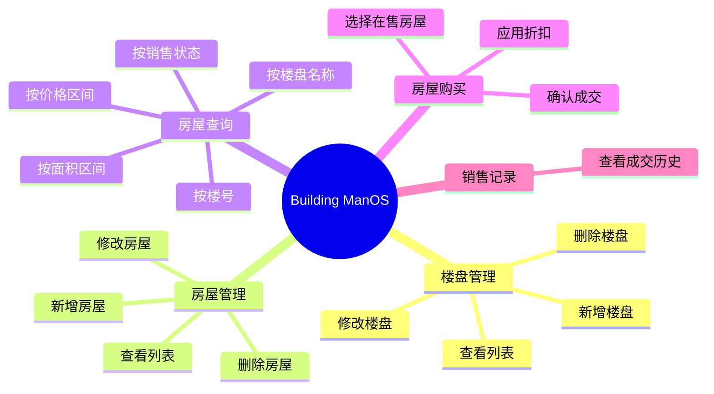

# 需求分析说明书

> **项目名称**：Building ManOS — 房地产公司房屋销售管理系统  
> **文档版本**：v0.1  
> **编写**：文档组（待填姓名）  
> **日期**：2026-07-10  
> **状态**：初稿，随开发进度更新

---

## 1. 引言

### 1.1 编写目的

本文档描述系统的业务需求与功能需求，作为设计、开发、测试和验收的依据。读者包括：项目组成员、指导教师、答辩评委。

### 1.2 项目背景

某房地产公司需要一套信息化工具，用于管理旗下楼盘与待售/已售房屋，支持销售人员在终端中快速查询房源、计算价格并完成成交登记。本系统为 JAVA 高级编程课程大作业，在**命令行环境**中实现，数据持久化至 **MySQL 数据库**。

### 1.3 术语定义

| 术语 | 定义 |
|------|------|
| 楼盘 | 房地产项目，包含位置、开发商等属性 |
| 楼号 | 楼盘内某一栋建筑的编号 |
| 房号 | 该栋内的房间编号 |
| 在售 | 房屋状态 `ON_SALE`，可查询、可购买 |
| 已售 | 房屋状态 `SOLD`，已成交不可再购 |

### 1.4 参考资料

- 课程大作业要求（见 [课程要求对照.md](./课程要求对照.md)）
- [项目计划.md](../../项目计划.md)

---

## 2. 可行性分析（简述）

| 维度 | 结论 |
|------|------|
| 技术 | Java + MySQL + JDBC 为课程已学技术，可行 |
| 经济 | 开源技术栈，无额外成本 |
| 操作 | 菜单驱动，培训成本低 |

---

## 3. 用户与角色

本系统为课程简化版，默认**单一操作员**（管理员/销售员合一），通过控制台菜单操作全部功能。

| 角色 | 描述 | 主要操作 |
|------|------|----------|
| 系统操作员 | 房地产公司工作人员 | 楼盘/房屋管理、查询、销售、查看记录 |

> 扩展（可选）：增加销售员登录，本版本可不实现。

---

## 4. 功能需求

### 4.1 功能总览

### 4.2 楼盘信息管理

| 编号 | 需求描述 | 优先级 |
|------|----------|--------|
| FR-B01 | 新增楼盘：录入名称、占地面积、地址、开发商、备注 | 高 |
| FR-B02 | 修改楼盘：根据编号更新信息 | 高 |
| FR-B03 | 删除楼盘：若下属仍有房屋则禁止删除 | 高 |
| FR-B04 | 查看楼盘列表及详情 | 高 |

### 4.3 房屋信息管理

| 编号 | 需求描述 | 优先级 |
|------|----------|--------|
| FR-H01 | 新增房屋：关联楼盘、楼号、房号、面积、单价 | 高 |
| FR-H02 | 系统自动计算总价 = 面积 × 单价 | 高 |
| FR-H03 | 修改房屋：仅「在售」状态可修改 | 高 |
| FR-H04 | 删除房屋：仅「在售」状态可删除 | 高 |
| FR-H05 | 同楼盘下楼号+房号不可重复 | 高 |
| FR-H06 | 按楼盘查看房屋列表 | 高 |

### 4.4 房屋查询

| 编号 | 需求描述 | 优先级 |
|------|----------|--------|
| FR-S01 | 按楼盘名称模糊查询房屋 | 高 |
| FR-S02 | 按楼号查询 | 中 |
| FR-S03 | 按价格区间查询 | 高 |
| FR-S04 | 按面积区间查询 | 中 |
| FR-S05 | 按销售状态（在售/已售）查询 | 高 |

### 4.5 房屋购买

| 编号 | 需求描述 | 优先级 |
|------|----------|--------|
| FR-P01 | 选择在售房屋进行购买 | 高 |
| FR-P02 | 展示房屋详情与原价 | 高 |
| FR-P03 | 支持至少两种折扣：比例折扣、满额减 | 高 |
| FR-P04 | 计算并显示实付金额 | 高 |
| FR-P05 | 确认后更新房屋为「已售」 | 高 |
| FR-P06 | 写入成交记录（客户姓名、折扣信息、实付价） | 高 |
| FR-P07 | 已售房屋不可重复购买 | 高 |

### 4.6 系统辅助

| 编号 | 需求描述 | 优先级 |
|------|----------|--------|
| FR-A01 | 主菜单与二级菜单导航 | 高 |
| FR-A02 | 用户输入合法性校验 | 高 |
| FR-A03 | 数据库连接失败时友好提示 | 中 |
| FR-A04 | 支持演示用初始数据导入 | 中 |

---

## 5. 非功能需求

| 编号 | 类别 | 需求描述 |
|------|------|----------|
| NFR-01 | 开发语言 | 必须使用 Java |
| NFR-02 | 数据库 | 必须使用数据库（MySQL）存取数据 |
| NFR-03 | 架构 | 分层架构：cli / service / dao |
| NFR-04 | 界面 | 仅控制台，禁止 GUI / Web |
| NFR-05 | 可维护性 | 代码含 JavaDoc，@author 标明编写者 |
| NFR-06 | 安全性 | SQL 使用 PreparedStatement |
| NFR-07 | 原创性 | 独立设计与实现，禁止抄袭 |

---

## 6. 用例说明（文字版）

### UC-01 购买房屋

| 项 | 内容 |
|----|------|
| 参与者 | 系统操作员 |
| 前置条件 | 系统中存在在售房屋；数据库连接正常 |
| 主成功场景 | 1. 操作员进入购买菜单 2. 选择在售房屋 3. 选择折扣类型 4. 输入客户姓名 5. 确认成交 6. 系统更新状态并记录 |
| 扩展 | 3a. 房屋已售：提示并返回 |
| 后置条件 | 房屋状态为 SOLD；`sale_record` 新增一条记录 |

> 建议文档组补充 UML 用例图至 `docs/requirements/images/`

---

## 7. 数据需求摘要

核心实体：楼盘、房屋、成交记录。详细字段见 [数据库设计.md](../design/数据库设计.md) 与 [数据字典.md](./数据字典.md)。

---

## 8. 约束与假设

- 假设单机部署，单用户操作
- 假设 MySQL 服务已启动且已执行建表脚本
- 不考虑并发购买同一套房的极端竞态（课程简化）

---

## 9. 版本记录

| 版本 | 日期 | 修订说明 |
|------|------|----------|
| v0.1 | 2026-07-10 | 初稿 |
